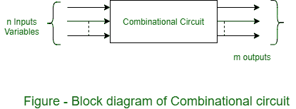
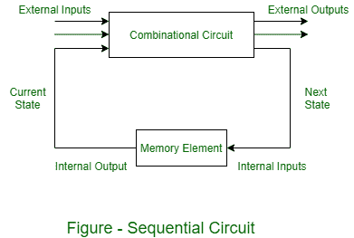

# 组合和时序电路

> 原文:[https://www . geeksforgeeks . org/组合和时序电路/](https://www.geeksforgeeks.org/combinational-and-sequential-circuits/)

数字逻辑(或开关)电路具有从一个值切换到另一个值的电压电平，但是具有有限数量的不同值(通常 0 表示假，1 表示真)。这些电路运行一套明确的逻辑规则，因此也称为逻辑电路。这些是用于手机、计算器、计算机等的基本电路。

**逻辑电路的类型:**
数字电路有两种类型，取决于它们的输出和使用的内存:

```
(i) Combinational circuit, and
(ii) Sequential circuit 
```

组合电路由逻辑门组成，这些逻辑门的输出在任何时候都只由当前的输入组合决定，它们没有存储器。时序电路由逻辑门组成，其输出在任何时候都是由当前输入和先前输出的组合决定的。这意味着时序电路使用存储元件来存储先前输出的值。

**1。[组合电路](https://www.geeksforgeeks.org/combinational-circuits-using-decoder/) :**
这些电路是使用“与”、“或”、“非”、“与非”和“或非”逻辑门开发的。这些逻辑门是组合电路的构件。组合电路由输入变量和输出变量组成。因为这些电路不依赖于先前的输入来产生任何输出，所以组合逻辑电路也是如此。一个组合电路可以有 n 个输入和 m 个输出。在组合电路中，任何时候的输出都是外加外部输入的直接函数。



**2。[时序电路](https://www.geeksforgeeks.org/introduction-of-sequential-circuits/) :**
时序电路由输入、输出和内部状态的时间序列指定。时序电路的输出不仅取决于当前输入的组合，还取决于先前的输出。与组合电路不同，时序电路包括具有组合电路的存储元件。



*   存储元件是能够存储二进制信息的电路。
*   在任何给定时间存储在这些存储元件中的二进制信息定义了当时时序电路的状态。
*   时序电路的外部输出取决于当前输入和先前输出状态。
*   存储元件的下一个状态也取决于外部输入和外部输出的当前状态。
*   一些时序电路可能不包含组合电路，而只包含存储元件。

通常使用两种类型的存储元件:[锁存器](https://www.geeksforgeeks.org/latches-in-digital-logic/)和[触发器](https://www.geeksforgeeks.org/flip-flop-types-and-their-conversion/)。以信号电平(而不是信号转换)操作的存储元件被称为锁存器；由时钟转换控制的是触发器。