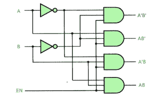
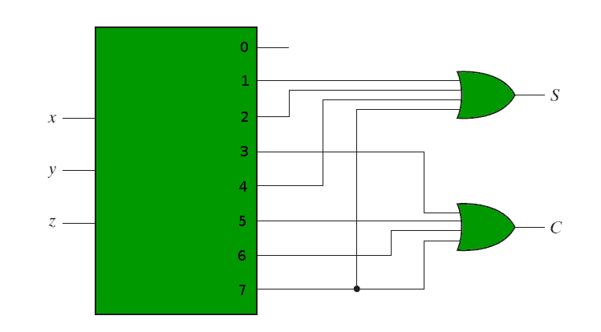

# 使用解码器的组合电路

> 原文:[https://www . geesforgeks . org/组合电路-使用解码器/](https://www.geeksforgeeks.org/combinational-circuits-using-decoder/)

先决条件- [二进制解码器](https://www.geeksforgeeks.org/digital-logic-binary-decoder/)、[多路复用器](https://www.geeksforgeeks.org/multiplexers-digital-electronics/)

解码器是将二进制信息从输入线转换到唯一输出线的组合电路。除了输入线之外，解码器也可以具有使能输入线。

**解码器作为解复用器–**

具有使能输入的解码器可以起到解复用器的作用。多路分解器是一种电路，它从一条线路接收信息，并将其导向其中一条可能的输出线路。

解复用器接收选择线和一条输入线作为输入。这些选择线用于从可能的线中选择一条输出线。为了实现解复用器，我们使用带有使能输入的解码器。多路分解器的选择线是解码器得到的输入线，多路分解器的一个输入线是解码器的使能输入。

使用带使能输入的 2:4 解码器制作 1:4 解复用器。设 A、B 为选择线，EN 为解复用器的输入线。
当 en 作为数据输入线，A 和 B 作为选择输入时，下面所示的解码器用作 2:4 解复用器。单个输入变量 E 有一条通向所有四个输出的路径，但输入信息仅指向输出线之一，如两条选择线 A 和 b 的二进制组合所指定的。这可以从电路的真值表中验证。

**真值表-**

**使用解码器的组合逻辑实现–**

解码器采用输入线，具有输出线。这些输出线可以提供输入变量的最小值。
由于任何布尔函数都可以表示为最小项的和，因此一个能够生成这些最小项的解码器，以及形成它们的逻辑和的外部或门，可以用来形成任何布尔函数的电路。

例如，如果我们需要实现全加器的逻辑，我们需要一个 3:8 解码器和或门。全加器的输入，即第一位、第二位和进位位，被用作解码器的输入。让 x，y 和 z 代表这三位。全加器的求和和进位输出有以下真值表-

因此我们有-

下面的电路图显示了全加器使用 3:8 解码器和或门的实现。

**参考文献-**
数字设计，第 5 版，作者:莫里斯·马诺和迈克尔·西莱蒂