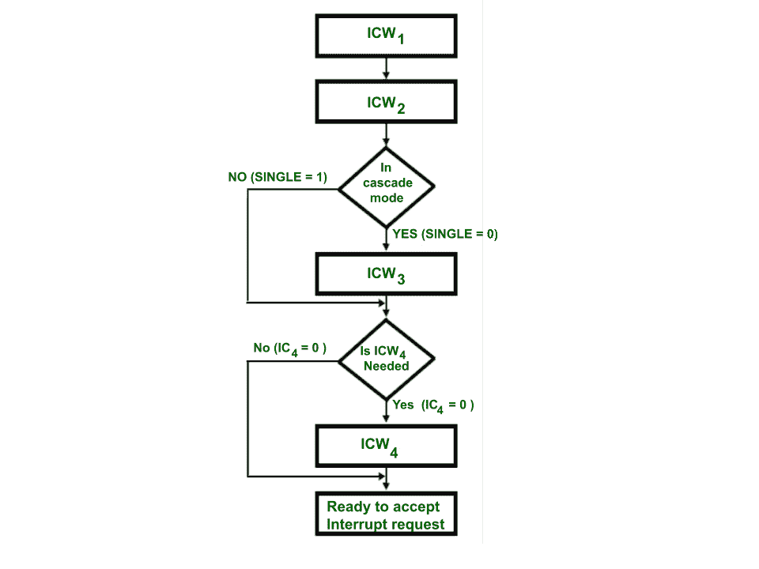
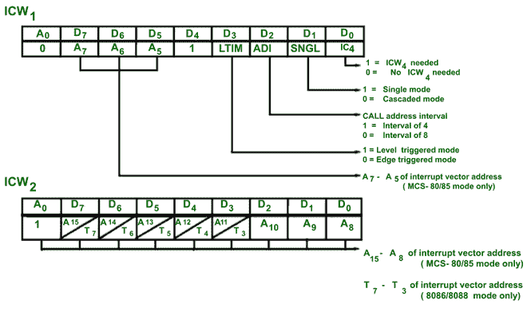
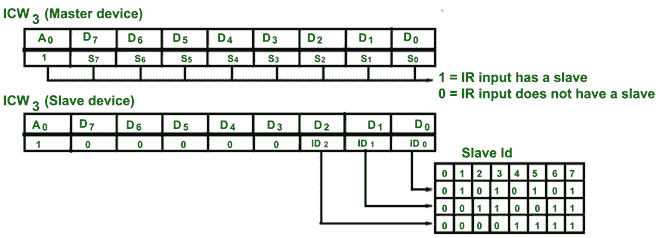
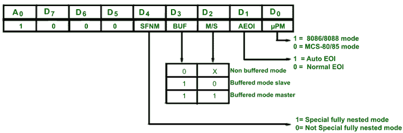
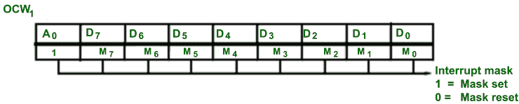
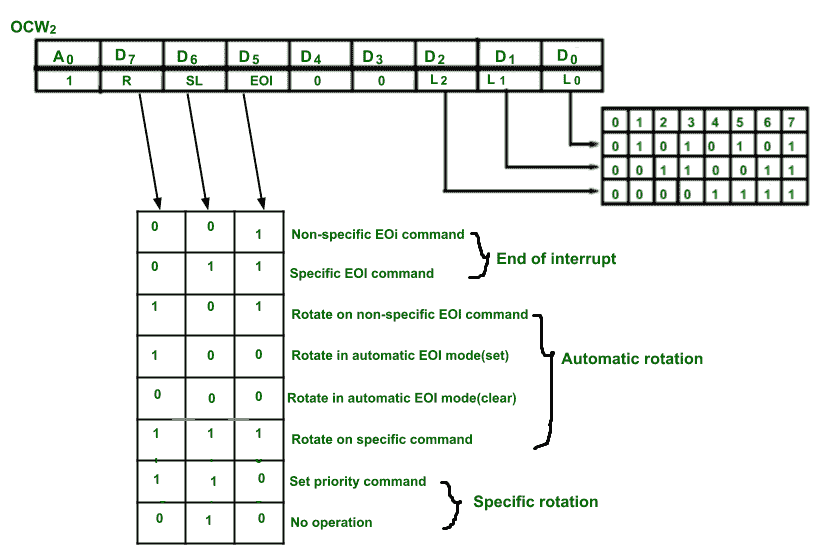
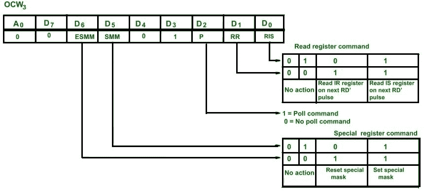

# 8259 PIC 的命令字

> 原文:[https://www.geeksforgeeks.org/command-words-of-8259-pic/](https://www.geeksforgeeks.org/command-words-of-8259-pic/)

8259 的命令字分为两部分:

*   初始化命令字(ICW)
*   操作命令字

**初始化命令字(ICW) :**

*   ICW 是在 8259 初始化期间给出的，即在其开始运行之前。
*   ICW 1 和 ICW 2 命令是初始化的强制命令。
*   ICW 3 命令在级联配置期间给出。
*   如果需要 ICW 4 ，则在 ICW 1 中指定。
*   发出 ICW 命令的顺序是固定的，即先发出 ICW 1 ，然后发出 ICW 2 ，再发出 ICW 3 。
*   任何 ICW 命令都不能重复，但如果需要，可以重复整个初始化过程。

**操作命令字(OCW) :**

*   OCW 在 8259 运行期间给出，即微处理器开始使用 8259。
*   对于 8259，OCW 命令不是强制性的。
*   给出 OCW 命令的顺序不是固定的。
*   OCW 命令可以重复。

**8259 的初始化序列:**

**ICW 1 命令:**

*   当 A 0 = 0，D 4 = 1 时，控制字识别为 ICW 1 。
*   它具有边缘和电平触发模式、单/级联模式、呼叫地址间隔以及是否需要 ICW4 的控制位。
*   地址线 A 7 至 A 5 用于中断向量地址。

当加载 ICW 1 时，执行的初始化为:

*   边沿检测电路复位，因为默认情况下，8259 中断是边沿触发的。
*   中断屏蔽寄存器被清零。
*   IR7 被指定为优先级 7。
*   从机模式地址分配为 7。
*   当 D 0 = 0 时，表示不需要 IC 4 命令。因此，IC4 中使用的功能被重置。
*   特殊屏蔽模式被重置，状态读取被分配给内部收益率。

**ICW 2 命令:**

*   当 A 0 = 1 时，控制字识别为 ICW 2 。
*   它存储关于中断向量地址的信息。
*   在基于 8085 的系统中，控制字的 A15 至 A 8 位用于中断向量地址。
*   在基于 8086 的系统中，插入 T 6 至 T 3 位代替 A 15 至 A 8 和 A 10 至 A 8 用于选择中断级别，即 000 用于 IR 0 和 111 用于 IR 7 。

**通过 ICW1 和 ICW2 命令字**初始化 8259

**ICW3:**T4】ICW3命令字在系统中存在多个 8259 时使用，即当 ICW 的 SNGL 位 1 为 0 时，将加载 8 位从寄存器。

**ICW3**

**ICW4【T2:**

*   当 AEOI = 1 时，则选择自动结束中断模式。
*   当 SFMN = 1 时，则选择特殊的完全嵌套模式。
*   当 BUF = 0 时，则使用非缓冲模式(即 M/S 为不在意)，当 M/S = 1 时，则 8259 为主，否则为从。
*   当 PM = 1 时，则执行 8086 个操作，否则执行 8085 个操作。

**ICW4**

**操作命令字(OCW) :**

**OCW1–**
用于设置和复位 IMR(中断屏蔽寄存器)中的屏蔽位。M7–M0描述 8 个掩码位

**OCW2–**
用于选择 8259 的工作模式。这里 L 2 到 L 0 用来描述需要执行动作的中断级别。

下图描述了详细的操作。

**OCW3–**

*   当设置了 ESMM(启用特殊屏蔽模式)位时，则 SMM 位是无关紧要的。如果 SMM = 1，ESMM = 1，则 8259 将进入特殊掩码模式。
*   如果 ESMM = 1，SMM = 0，那么 8259 将返回正常屏蔽模式。
*   RR 和 RIS 用于给出读寄存器命令。
*   P = 1 用于轮询命令。

