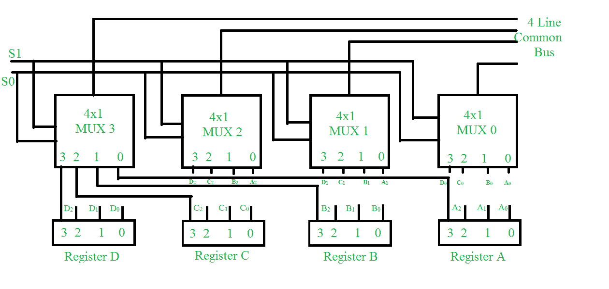

# 使用多路复用器的公共总线系统

> 原文:[https://www . geesforgeks . org/common-bus-system-use-multiplexers/](https://www.geeksforgeeks.org/common-bus-system-using-multiplexers/)

一台典型的计算机有许多寄存器，我们需要在这些寄存器之间传输信息。传输信息的一种方法是使用公共总线系统。在本文中，我们将讨论使用[多路复用器](https://www.geeksforgeeks.org/multiplexers-in-digital-logic/)的公共总线系统。



让我们讨论带有多路复用器的公共总线系统。

4 个寄存器的总线系统的结构如上所示。该总线包括 4×1 多路复用器，具有 4 个输入和 1 个输出，以及 4 个寄存器，位号为 0 至 3。有 2 个选择输入 S0 和 S1 连接到多路复用器的选择输入。

寄存器 A 的输出 1 连接到多路复用器 1 的输入 0，类似地，如图所示进行其他连接。传输到总线的数据取决于选择线。下表显示了选择线的各种组合。

<center>

| 选择线组合 S1S0 | 已选择注册 |
| --- | --- |
| 00 | 注册 |
| 01 | 注册 |
| Ten | 寄存器 C |
| Eleven | 注册的 |

</center>

我们可以看到，当 S1S0=00 时，选择寄存器 A 是因为在 00 时，所有多路复用器的 0 数据输入都施加到公共总线。

由于所有多路复用器的 0 数据输入接收来自寄存器 A 的输入，因此寄存器 A 被选择。类似地，对于 S1S0 的其他组合，选择其他寄存器。

**注-**

```
No. of multiplexers needed = No. of bits in each register 
```