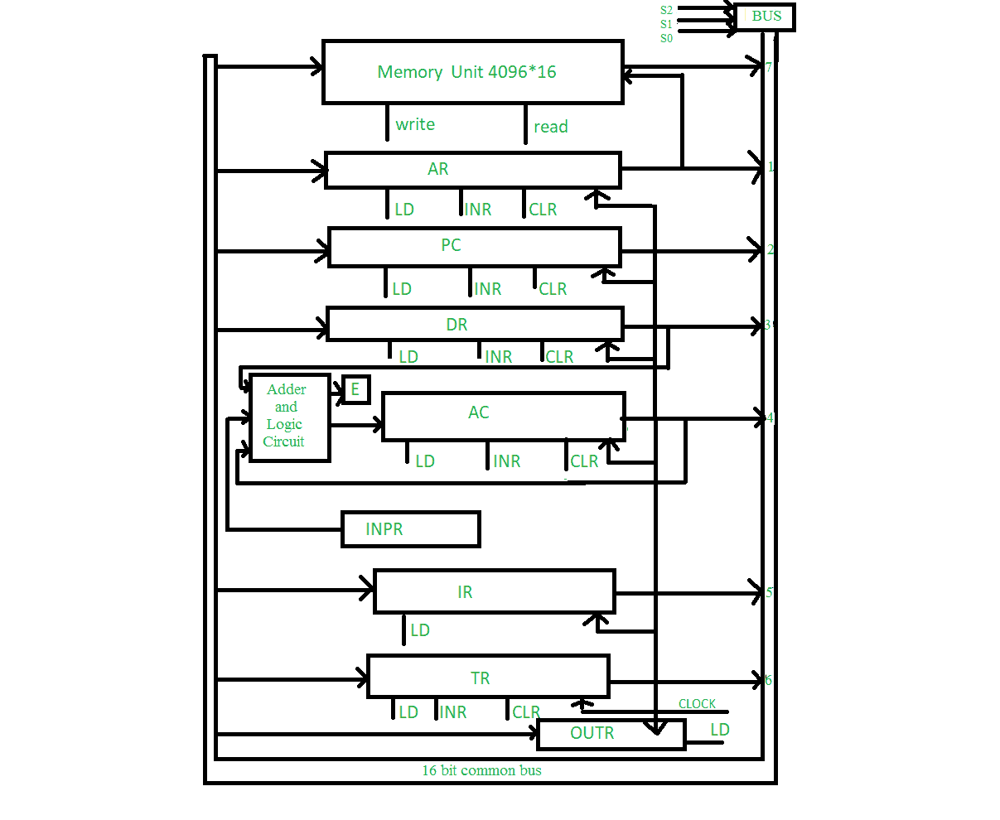

# 公共总线系统

> 原文:[https://www.geeksforgeeks.org/common-bus-system/](https://www.geeksforgeeks.org/common-bus-system/)

在这篇文章中，我们将研究一台非常基本的计算机的公共总线系统。一台基本计算机有 8 个寄存器、存储单元和一个控制单元。公共总线系统的示意图如下所示。

**连接:**
除了 OUTR(输出寄存器)之外，所有寄存器的输出都连接到公共总线。选择的输出取决于变量 S2、S1 和 S0 的二进制值。公共总线的线路连接到寄存器和存储器的输入端。当其 LD(加载)输入被激活时，寄存器从总线接收信息，而在存储器的情况下，必须使能写输入才能接收信息。当它的读输入被激活时，存储器的内容被放到总线上。

**各种寄存器:**
4 个寄存器 DR、AC、IR 和 TR 为 16 位，2 个寄存器 AR 和 PC 为 12 位。INPR 和奥特各有 8 位。INPR 从输入设备接收字符并将其传送到交流，而外接程序从交流接收字符并将其传送到输出设备。5 个寄存器有 3 个控制输入 LD(负载)、INR(增量)和 CLR(清零)。这些类型的寄存器类似于二进制计数器。

| 缩写 | 寄存器名 |
| --- | --- |
| OUTR | 输出寄存器 |
| 土耳其 | 暂存寄存器 |
| 红外辐射（Infrared Radiation） | 指令寄存器 |
| INPR | 输入寄存器 |
| 交流电（alternating current） | 蓄电池 |
| 速度三角形定位法(dead reckoning) | 数据寄存器 |
| 个人电脑 | 程序计数器 |
| 阿肯色州 | 地址寄存器 |

**加法器和逻辑电路:**
加法器和逻辑电路提供交流的 16 路输入。该电路有 3 组输入。一组来自实现寄存器微操作的交流输出。另一组来自用于执行算术和逻辑微操作的数据寄存器。这些操作的结果被发送到交流，而进位的结束存储在 E 中，如图所示。第三组输入来自 INPR。

**注意:**
任何寄存器的内容都可以放在公共总线上，并且在同一时钟周期内，可以在加法器和逻辑电路中执行操作。