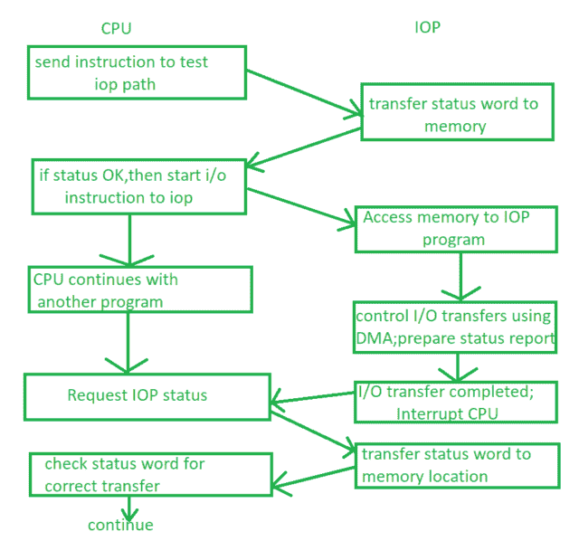

# CPU 与 IOP 之间的通信通道

> 原文:[https://www . geesforgeks . org/communication-channel-介于 cpu 和 iop 之间/](https://www.geeksforgeeks.org/communication-channel-between-cpu-and-iop/)

在 IOP 和 CPU 之间有一个通信通道来执行计算机体系结构下的任务。该频道解释了在执行圆顶程序时由 IOP 和 CPU 执行的命令。中央处理器不执行指令，但它分配启动操作的任务，指令由 IOP 执行。输入输出传输由中央处理器指示。IOP 通过中断请求 CPU。

该通道由 CPU 启动，向 IOPs 发出“测试 IOPs 路径”指令，然后通信开始，如图所示:

**Figure –** Communication channel between IOP and CPU

每当中央处理器从 IOPs 获得访问内存的中断时，它都会向 IOPs 发送测试路径指令。IOPs 执行并检查状态，如果给 CPU 的状态是正常的，那么 CPU 给 IOPs 一个启动指令，并给它一些控制，回到另一个(或相同的)程序，之后 IOPs 能够为它的程序访问内存。

现在，IOP 开始使用 DMA 控制输入/输出传输，并创建另一个状态报告。一旦该输入/输出传输完成，IOPs 再次向中央处理器发送中断，中央处理器再次请求 IOPs 状态，从内存位置检查 IOPs 状态字并将其提供给中央处理器。现在，中央处理器检查状态的正确性，并继续相同的过程。