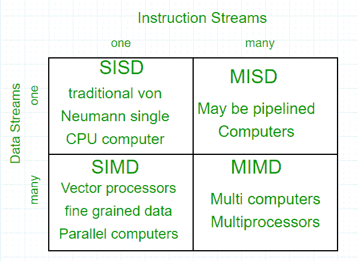
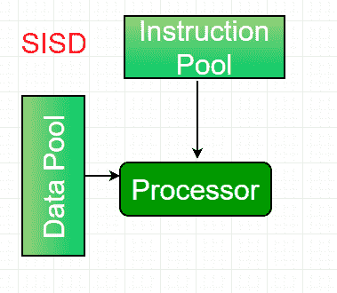
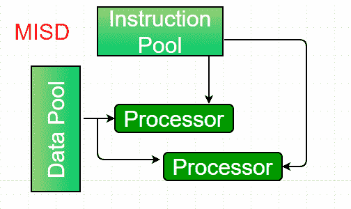
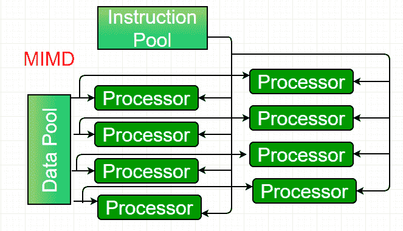

# 计算机架构|弗林分类法

> 原文:[https://www . geeksforgeeks . org/computer-architecture-flynns-分类学/](https://www.geeksforgeeks.org/computer-architecture-flynns-taxonomy/)

**并行计算**是一种将作业分解成可以并发执行的离散部分的计算。每个部分进一步细分为一系列指令。每个部分的指令在不同的中央处理器上同时执行。并行系统处理多个计算机资源的同时使用，这些资源可以包括具有多个处理器的单个计算机、通过网络连接形成并行处理集群的多个计算机或两者的组合。
并行系统比单处理器的计算机更难编程，因为并行计算机的体系结构会相应变化，多个 CPU 的进程必须协调和同步。

并行处理的关键是 CPU。根据可同时处理的**指令和**数据流的数量，计算系统分为四大类:

**弗林的分类–**

1.  **Single-instruction, single-data (SISD) systems –**
    An SISD computing system is a uniprocessor machine which is capable of executing a single instruction, operating on a single data stream. In SISD, machine instructions are processed in a sequential manner and computers adopting this model are popularly called sequential computers. Most conventional computers have SISD architecture. All the instructions and data to be processed have to be stored in primary memory.

    

    SISD 模型中处理单元的速度受到计算机内部传输信息的速率的限制。占主导地位的代表 SISD 系统是 IBM 个人电脑、工作站。

2.  **Single-instruction, multiple-data (SIMD) systems –**
    An SIMD system is a multiprocessor machine capable of executing the same instruction on all the CPUs but operating on different data streams. Machines based on an SIMD model are well suited to scientific computing since they involve lots of vector and matrix operations. So that the information can be passed to all the processing elements (PEs) organized data elements of vectors can be divided into multiple sets(N-sets for N PE systems) and each PE can process one data set.

    

    SIMD 系统的主要代表是克雷的向量处理机。

3.  **Multiple-instruction, single-data (MISD) systems –**
    An MISD computing system is a multiprocessor machine capable of executing different instructions on different PEs but all of them operating on the same dataset .

    

    例 Z = sin(x)+cos(x)+tan(x)
    系统对同一数据集执行不同的操作。使用 MISD 模型制造的机器在大多数应用中都没有用，虽然制造了一些机器，但是没有一个是商用的。

4.  **Multiple-instruction, multiple-data (MIMD) systems –**
    An MIMD system is a multiprocessor machine which is capable of executing multiple instructions on multiple data sets. Each PE in the MIMD model has separate instruction and data streams; therefore machines built using this model are capable to any kind of application. Unlike SIMD and MISD machines, PEs in MIMD machines work asynchronously.

    

    根据 PEs 与主存储器的耦合方式，MIMD 机器大致分为**共享内存 MIMD** 和**分布式内存 MIMD** 。

    在**共享内存 MIMD** 模型(紧耦合多处理器系统)中，所有的处理器都连接到一个全局内存，并且它们都可以访问它。该模型中的进程间通信通过共享内存进行，一个进程对存储在全局内存中的数据的修改对所有其他进程都是可见的。共享内存系统的主要代表是硅图形机和 Sun/IBM 的 SMP(对称多处理)。
    在**分布式内存 MIMD** 机器(松散耦合的多处理器系统)中，所有的处理器都有一个本地内存。该模型中进程间的通信通过互连网络(进程间通信信道，简称 IPC)进行。连接 PEs 的网络可以配置为树形、网状或根据需要。
    共享内存 MIMD 架构更容易编程，但对故障的容忍度更低，并且相对于分布式内存 MIMD 模型更难扩展。共享内存 MIMD 中的故障会影响整个系统，而分布式模型则不是这样，在分布式模型中，每个进程可以很容易地被隔离。此外，共享内存 MIMD 架构不太可能扩展，因为添加更多的 PEs 会导致内存争用。这种情况在分布式内存的情况下不会发生，在分布式内存的情况下，每个 PE 都有自己的内存。从实际结果和用户需求来看，分布式内存 MIMD 架构优于现有的其他模型。

**参考–**
[弗林分类法](https://en.wikipedia.org/wiki/Flynn%27s_taxonomy)
[掌握云计算](https://www.amazon.in/Mastering-Cloud-Computing-Foundations-Applications/dp/0124114547):基础和应用编程