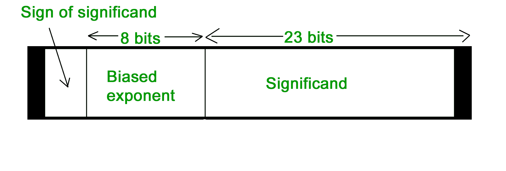
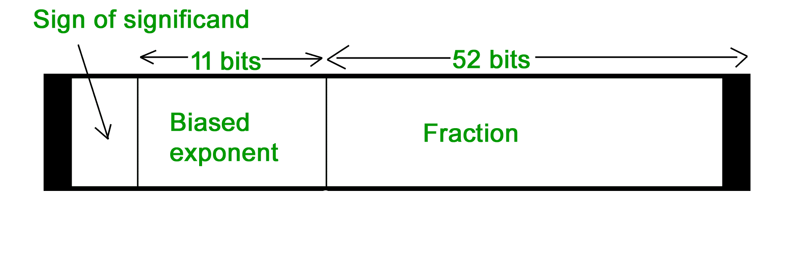

# 计算机算法|设置–1

> 原文:[https://www.geeksforgeeks.org/computer-arithmetic-set-1/](https://www.geeksforgeeks.org/computer-arithmetic-set-1/)

<u>**负数表示**</u>

*   **星座星等**

符号幅度是负数的非常简单的表示。在符号幅度中，第一位专用于表示符号，因此称为符号位。

符号位‘1’表示负号。

符号位‘0’代表正号。

在 n 位数字的符号幅度表示中，第一位代表符号，其余 n-1 位代表数字的幅度。

例如

*   +25 = 011001

其中 11001 = 25

和 0 代表“+”

*   -25 = 111001

其中 11001 = 25

和 1 代表“-”。 

**符号幅度法表示的数字范围** = -(2 <sup>n-1</sup> -1)至+(2 <sup>n-1</sup> -1)(对于 n 位数字)

但是符号幅度有一个问题，那就是我们有 0 的两种表示

+0 = 000000

–0 = 100000

*   **2 的补法**

要用这种形式表示负数，首先需要取简单正二进制形式表示的数的 1 的补码，然后再加 1。

例如:

(-8)10=(1000)2

1000 的 1 的补码= 0111

加 1，0111 + 1 = 1000

所以，(-8)10=(1000)T9】2

请不要与(8)10= 1000 和(-8)10= 1000 同 4 位一样，我们不能代表大于 7 的正数。所以，1000 只代表-8。

**2 的补码代表的数字范围=** ( -2 <sup>n-1</sup> 到 2<sup>n-1</sup>–1)

<u>**数字的浮点表示**</u>

*   **32 位表示浮点数 IEEE 标准**

[](https://media.geeksforgeeks.org/wp-content/uploads/32-bit-representation-floating-point-numbers-IEEE-standard.jpg) 
**常态化**

*   浮点数通常归一化
*   调整指数，使得尾数的前导位(MSB)为 1
*   因为总是 1，所以不需要存储
*   科学记数法，其中数字被标准化，在小数点前给出一位数，如在十进制中，例如 3.123 x 10 <sup>3</sup>

例如，我们用 32 位格式表示 3.625。

二进制改变 3 = 11

以二进制形式更改. 625

```
 .625 X 2 1  .25 X 2 0  .5 X 2 1 
```

以二进制指数形式书写

3.625 = 11.101×2<sup>T3【0】T5】</sup>

关于规格化

11.101×2T20T5= 1.1101×2T81T11】

偏置指数= 127 + 1 = 128

(128)10=(10000000)2

**用于获得有效数字**

小数点后的数字= 1101

扩展到 23 位= 110100000000000000000000000000

**设置标志位**

由于是正数，符号位= 0

最后我们根据表象进行安排

```
Sign bit      exponent      significand
```

010000000 1101000000000000000000000000000000000000000000000000000000000000000000000000

*   **64 位表示浮点数 IEEE 标准**

[](https://media.geeksforgeeks.org/wp-content/uploads/64-bit-representation-floating-point-numbers-IEEE-standard.jpg) 
我们再一次遵循同样的程序直到正常化。之后，我们加上 1023 来偏置指数。 

例如，我们用 64 位格式表示-3.625。

二进制改变 3 = 11

以二进制形式更改. 625

```

.625 X 2     1

.25 X 2       0

.5 X 2         1
```

以二进制指数形式书写

3.625 = 11.101×2<sup>T3【0】T5】</sup>

关于规格化

11.101×2T20T5= 1.1101×2T81T11】

偏置指数 1023 + 1 = 1024

(1024)10=(1000000000)2

所以 11 位指数= 10000000000

52 位有效位= 110100000000 ……总共 52 位

设置符号位= 1(数字为负)

那么，最终表示

1 10000000000 11010000000……通过添加更多的 0总共 52 位

<u>**将浮点转换为十进制**</u>

我们把一个 FP 数转换成十进制

1 01111100 11000000000000000000000000

IEEE 数字的十进制值由公式给出:

**(1-2s)*(1+f)* 2<sup>(e–bias)</sup>**

其中

*   这里 s、f、e 字段取小数。
*   (1 -2s)为 1 或-1，取决于符号位 0 和 1
*   在有效数字(分数域 f)上加一个隐含的 1，如公式所示

同样，单精度或双精度的偏差分别为 127 或 1023。

首先将每个单独的字段转换为十进制。

*   符号位 s 为 1
*   e 字段包含 01111100 =(124)10
*   尾数为 0.11000……=(0.75)10

将这些值输入公式

(1–2)*(1+0.75)* 2<sup>124–127</sup>=(–1.75 * 2<sup>-3</sup>)=–0.21875

本文由 Anuj Batham 撰写。

如果您发现任何不正确的地方，或者您想分享更多关于上面讨论的主题的信息，请写评论