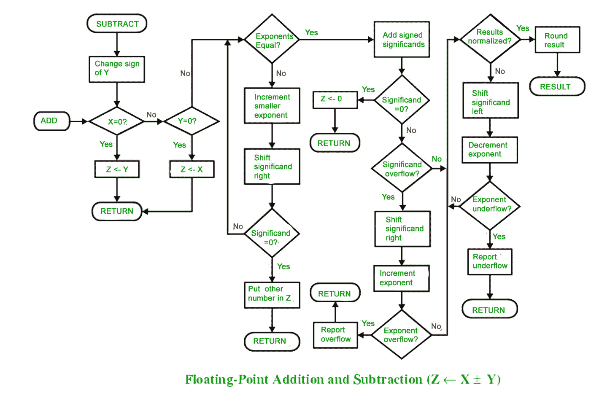

# 计算机算法|设置–2

> 原文:[https://www.geeksforgeeks.org/computer-arithmetic-set-2/](https://www.geeksforgeeks.org/computer-arithmetic-set-2/)

**<u>【浮点加减】</u>**

*   **浮点加法**

为了理解浮点加法，首先我们看到十进制实数的加法，因为在这两种情况下应用了相同的逻辑。

**比如**我们要加**1.1 * 103T6**50。****

我们不能直接加这些数字。首先，我们需要对齐指数，然后，我们可以添加显著的。

对齐指数后，得到**50 = 0.05 * 103**T5】

现在加显著，**0.05+1.1 = 1.15**T3】

所以，最后我们得到**(1.1 * 103+50)= 1.15 * 103**

在这里，注意我们移动了 **50** 并使其 **0.05** 来添加这些数字。

**现在我们来举个浮点数加法的例子**

我们按照以下步骤添加两个数字:

1。对齐重要的

2。添加重要的

3。将结果标准化

**让两个数字为**

x = 9.75T2y = 0.5625

将其转换为 32 位浮点表示，

**9.75**32 位格式的表示=**0 10000010 001110000000000000000000**

**0.5625**32 位格式的表示=**0 01111110 00100000000000000000000**

现在我们得到指数的差，知道需要多少移位。

(**10000010–01111110**)2 =(**4**)10

现在，我们将较小数字的尾数向右移动 4 个单位。

尾数**0.5625 = 1.001000000000000000000000000**

(注意小数点前 1 理解为 32 位表示)

右移 **4** 单位，我们得到**0.000100100000000000000000000000000000000000000000000000000000000000000000000000000**

尾数 **9.75** = **1。00111000000000000000000000000**

将两者的尾数相加

**0。00010010000000000000000000**

**+ 1。00111000000000000000000000000**

——————————————

**1。01001010000000000000000000**

在最终答案中，我们取较大数的指数

那么，最终答案包括:

符号位= **0**

较大数的指数= **10000010**

尾数=**0100101000000000000000000**

答案的 32 位表示=**x+y**=**0 10000010 010010100000000000000000**

*   **浮点减法**

减法类似于加法，但有一些不同之处，比如我们减去尾数不像加法，在符号位我们放入更大数字的符号。

**让两个数字为**

x = 9.75
T3】y =–0.5625

将其转换为 32 位浮点表示

**9.75**32 位格式的表示=**0 10000010 001110000000000000000000**

**–0.5625**32 位格式的表示=**1 01111110 001000000000000000000000000000000000000000000000000000000000000000000000000000000**

现在，我们找到指数的差异来知道需要多少移位。

(**10000010–01111110**)2 =(**4**)10
现在，我们将较小数字的尾数向右移动 4 个单位。

尾数**–**T3】0.5625 = 1.001000000000000000000000000000000000000000000000000000000000000000000000000000000

(注意小数点前 1 理解为 32 位表示)

右移 **4** 单位，**0.000100000000000000000000000000000000000000000000000000000000000000000000000000000**

尾数 **9.75** = **1。00111000000000000000000000000**

减去两者的尾数

**0。00010010000000000000000000**

**–1。00111000000000000000000000000**

————————————————

**1。00100110000000000000000000**

较大数字的符号位= **0**

所以，最后的答案=**x–y = 0 10000010 00100110000000000000000000000000000000000000000000000000000000000000000000000000**

本文由 Anuj Batham 撰写。

如果您发现任何不正确的地方，或者您想分享更多关于上面讨论的主题的信息，请写评论