# 计算机组织|阿姆达尔定律及其证明

> 原文:[https://www . geesforgeks . org/computer-organization-amdahl s-law-and-it-proof/](https://www.geeksforgeeks.org/computer-organization-amdahls-law-and-its-proof/)

它以计算机科学家吉恩·阿姆达尔(来自 IBM 和阿姆达尔公司的计算机架构师)的名字命名，并于 1967 年在 AFIPS 春季联合计算机会议上发表。也被称为 ***安达尔的论点*** 。这是一个公式，给出了在资源得到改善的系统在固定工作负载下执行任务的理论延迟加速。换句话说，它是一个公式，用于通过仅仅改进系统的特定部分来寻找最大可能的改进。在*并行计算*中经常使用它来预测使用多处理器时的理论加速比。

**加速-**
加速被定义为使用增强的整个任务的性能与不使用增强的整个任务的性能之比，或者加速可以被定义为不使用增强的整个任务的执行时间与使用增强的整个任务的执行时间之比。
如果 **Pe** 是在可能的情况下使用增强的整个任务的性能， **Pw** 是不使用增强的整个任务的性能， **Ew** 是不使用增强的整个任务的执行时间， **Ee** 是在可能的情况下使用增强的整个任务的执行时间，

**加速= Pe/Pw**
或
**加速= Ew/Ee**

阿姆达尔定律使用两个因素来发现某些增强带来的加速——

*   **分数增强**–原始计算机中计算时间的分数，可以转换为利用增强。例如，如果一个总共花费 40 秒的程序的 10 秒执行时间可以使用一个增强，那么这个分数就是 10/40。该获得值为*分数增强*。
    *强化分数始终小于 1* 。*   **Speedup enhanced** – The improvement gained by the enhanced execution mode; that is, how much faster the task would run if the enhanced mode were used for the entire program. For example – If the enhanced mode takes, say 3 seconds for a portion of the program, while it is 6 seconds in the original mode, the improvement is 6/3\. This value is Speedup enhanced.
    *Speedup Enhanced is always greater than 1*.

    整体加速是执行时间的比率:-

    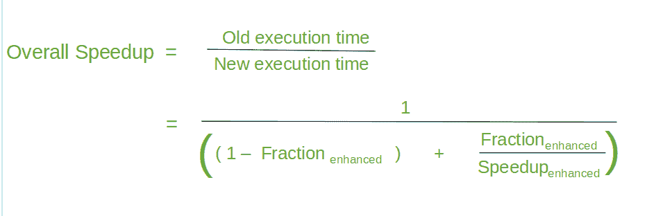

    **证明:-**
    让加速为 S，旧的执行时间为 T，新的执行时间为 T’，A 部分(将被增强)占用的执行时间为 T，A 部分(增强后)占用的执行时间为 T’，不被增强的部分占用的执行时间为 t n ，分数增强为 f’，加速增强为 S’。

    从上面的等式中，

    

    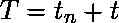

    

    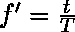

    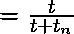

    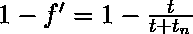

    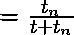

    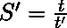

    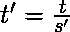

    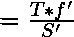

    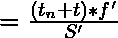

    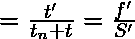

    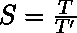

    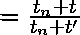

    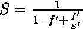

    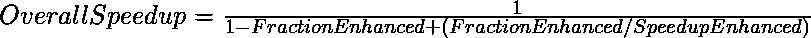
    遂证。