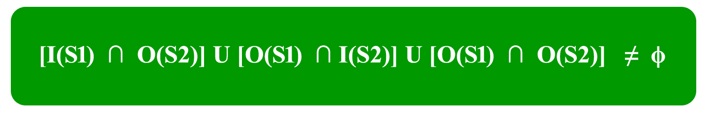

# 计算机组织和架构|流水线|集合 2(依赖性和数据危害)

> 原文:[https://www . geesforgeks . org/computer-organization-and-architecture-pilot-set-2-dependencies-and-data-hazard/](https://www.geeksforgeeks.org/computer-organization-and-architecture-pipelining-set-2-dependencies-and-data-hazard/)

执行、阶段和性能(吞吐量)见 [**设置 1**](https://www.geeksforgeeks.org/computer-organization-and-architecture-pipelining-set-1-execution-stages-and-throughput/) ，管道和停转类型见 [**设置 3**](https://www.geeksforgeeks.org/computer-organization-and-architecture-pipelining-set-3-types-and-stalling/) 。流水线处理器中的依赖关系

流水线处理器中主要有三种可能的依赖关系。这些是:
1)结构依赖
2)控制依赖
3)数据依赖

这些依赖关系可能会在管道中引入停顿。

**失速:**失速是管道中没有新输入的循环。

**结构依赖**

这种依赖性是由于管道中的资源冲突而产生的。资源冲突是指多个指令试图在同一周期内访问同一资源的情况。资源可以是寄存器、内存或算术逻辑单元。

示例:

| 指令/周期 | one | Two | three | four | five |
| --- | --- | --- | --- | --- | --- |
| 一 1 | 中频(Mem) | 身份证明 | 前妻；前夫 | <mark>迷</mark> |  |
| 一二 |  | 中频(Mem) | 身份证明 | 前妻；前夫 |  |
| 一 3 |  |  | 中频(Mem) | 身份证明 | 前妻；前夫 |
| 一 4 |  |  |  | <mark>中频(Mem)</mark> | 身份证明 |

在上面的场景中，在周期 4 中，指令 I 1 和 I 4 试图访问相同的资源(内存)，这引入了资源冲突。
为了避免这个问题，我们必须保持指令开启，直到所需的资源(在我们的例子中是内存)变得可用。这种等待会在管道中引入如下所示的停顿:

| 循环 | one | Two | three | four | five | six | seven | eight |
| --- | --- | --- | --- | --- | --- | --- | --- | --- |
| 一 1 | 中频(Mem) | 身份证明 | 前妻；前夫 | Mem | 世界银行 |  |  |  |
| 一二 |  | 中频(Mem) | 身份证明 | 前妻；前夫 | Mem | 世界银行 |  |  |
| 一 3 |  |  | 中频(Mem) | 身份证明 | 前妻；前夫 | Mem | 世界银行 |  |
| 一 4 |  |  |  | – | – | – | 中频(Mem) |  |

**结构依赖的解决方案**
为了最小化流水线中的结构依赖停顿，我们使用了一种叫做重命名的硬件机制。
**重命名:**根据重命名，我们将内存分为两个独立的模块，分别用于存储指令和数据，分别称为代码内存(CM)和数据内存(DM)。CM 将包含所有指令，DM 将包含指令所需的所有操作数。

| 指令/周期 | one | Two | three | four | five | six | seven |
| --- | --- | --- | --- | --- | --- | --- | --- |
| 一 1 | 中频(厘米) | 身份证明 | 前妻；前夫 | 分米 | 世界银行 |  |  |
| 一二 |  | 中频(厘米) | 身份证明 | 前妻；前夫 | 分米 | 世界银行 |  |
| 一 3 |  |  | 中频(厘米) | 身份证明 | 前妻；前夫 | 分米 | 世界银行 |
| 一 4 |  |  |  | 中频(厘米) | 身份证明 | 前妻；前夫 | 分米 |
| 一 5 |  |  |  |  | 中频(厘米) | 身份证明 | 前妻；前夫 |
| 一 6 |  |  |  |  |  | 中频(厘米) | 身份证明 |
| 一 7 |  |  |  |  |  |  | 中频(厘米) |

**控制依赖(分支危害)**
这种类型的依赖发生在转移分支、调用、JMP 等控制指令的过程中。在许多指令体系结构中，当处理器需要将新指令插入流水线时，它不知道这些指令的目标地址。因此，不需要的指令被送入管道。

考虑程序中的以下指令顺序:
100:I1T3】101:I2(JMP 250)
102:I3T9】。
。
250: BI 1

预期输出:I1->I2->BI1

注:一般来说，JMP 指令的目标地址只有在识别阶段之后才知道。

| 指令/周期 | one | Two | three | four | five | six |
| --- | --- | --- | --- | --- | --- | --- |
| 一 1 | 如果 | 身份证明 | 前妻；前夫 | MEM | 世界银行 |  |
| 一二 |  | 如果 | 身份证 （邮编：250） | 前妻；前夫 | Mem | 世界银行 |
| 一 3 |  |  | 如果 | 身份证明 | 前妻；前夫 | Mem |
| BI 1 |  |  |  | 如果 | 身份证明 | 前妻；前夫 |

输出顺序:I1->I2->I3->BI1

因此，输出序列不等于预期的输出，这意味着管道没有正确实现。

为了纠正上述问题，我们需要停止指令提取，直到我们得到分支指令的目标地址。这可以通过引入延迟槽直到我们得到目标地址来实现。

| 指令/周期 | one | Two | three | four | five | six |
| --- | --- | --- | --- | --- | --- | --- |
| 一 1 | 如果 | 身份证明 | 前妻；前夫 | MEM | 世界银行 |  |
| 一二 |  | 如果 | 身份证 （邮编：250） | 前妻；前夫 | Mem | 世界银行 |
| 耽搁 | – | – | – | – | – | – |
| BI 1 |  |  |  | 如果 | 身份证明 | 前妻；前夫 |

输出顺序:I 1 - > I 2 - >延迟(失速)- > BI 1

由于延迟时隙不执行任何操作，该输出序列等于预期的输出序列。但是这个槽在管道中引入了停滞。

**控制依赖的解决方案**分支预测是一种可以消除由于控制依赖而导致的停顿的方法。在第一阶段，预测将采取哪个分支。对于分支预测，分支惩罚为零。

**分支惩罚:**在流水线处理器中的分支操作期间引入的停顿数量被称为分支惩罚。

**注意:**如我们所见，目标地址在 ID 阶段后可用，因此管道中引入的停顿数为 1。假设分支目标地址会出现在 ALU 阶段之后，会有 2 个停顿。一般来说，如果目标地址出现在第 k 个阶段之后，那么在流水线中将会有(k–1)个停顿。

由于分支指令在管道中引入的暂停总数= **分支频率*分支惩罚**

**数据依赖(数据危害)**
让我们考虑一个 ADD 指令 S，这样
S : ADD R1、R2、R3
由 S = I(S) = {R2、R3}
读取的地址由 S = O(S) = {R1}写入的地址

现在，我们说 S2 指令依赖于 S1 指令，什么时候

 
这个条件叫做伯恩斯坦条件。

存在三种情况:

*   流量(数据)依赖:O(S1) ∩ I (S2)，S1 → S2 和 S1 在 S2 读完一些东西后写
*   反依赖:我(S1) ∩ O(S2)，S1 → S2 和 S1 在 S2 改写之前先读一些东西
*   输出依赖:O(S1)∞O(S2)，S1 → S2，都写同一个内存位置。

例如:假设有两条指令 I1 和 I2，例如:
I1:添加 R1、R2、R3
I2 : SUB R4、R1、R2

当上述指令在流水线处理器中执行时，将会出现数据依赖的情况，这意味着我 2 在我 1 写入数据之前尝试读取数据，因此，我 2 错误地从我 1 获取旧值。

| 指令/周期 | one | Two | three | four |
| --- | --- | --- | --- | --- |
| 一 1 | 如果 | 身份证明 | 前妻；前夫 | 分米 |
| 一二 |  | 如果 | <mark>ID(旧值)</mark> | 前妻；前夫 |

为了最小化流水线中的数据相关性停顿，使用了**操作数转发**。

**操作数转发:**在操作数转发中，我们使用存在于级间的接口寄存器来保存中间输出，以便相关指令可以直接从接口寄存器访问新值。

考虑同一个例子:
I1:添加 R1、R2、R3
I2 : SUB R4、R1、R2

| 指令/周期 | one | Two | three | four |
| --- | --- | --- | --- | --- |
| 一 1 | 如果 | 身份证明 | 前妻；前夫 | 分米 |
| 一二 |  | 如果 | 身份证明 | 前妻；前夫 |

**数据危害**

当表现出数据依赖性的指令在流水线的不同阶段修改数据时，就会发生数据危害。危险导致管道延误。主要有三种类型的数据危害:

1) RAW(写后读)[流/真数据依赖]
2) WAR(读后写)[反数据依赖]
3) WAW(写后写)[输出数据依赖]

假设有两个指令 I 和 J，使得 J 跟随 I。然后，

*   当指令 J 试图在指令 I 写入数据之前读取数据时，会发生 RAW 危险。
    Eg:
    I:R2<-R1+R3
    J:R4<-R2+R3
*   当指令 J 试图在指令 I 读取数据之前写入数据时，就会发生 WAR 危险。
    Eg:
    I:R2<-R1+R3
    J:R3<-R4+R5
*   当指令 J 试图在指令 I 写输出之前写输出时，会发生 WAW 危险。
    Eg:
    I:R2<-R1+R3
    J:R2<-R4+R5

在无序执行指令的过程中会出现 WAR 和 WAW 危险。

来源:[goo.gl/J9KVNt](http://goo.gl/J9KVNt)
T4【https://en . Wikipedia . org/wiki/hard _(computer _ architecture)
[https://en.wikipedia.org/wiki/Data_dependency](https://en.wikipedia.org/wiki/Data_dependency)

本文由 Saurabh Sharma 供稿。

如果您发现任何不正确的地方，或者您想分享更多关于上面讨论的主题的信息，请写评论