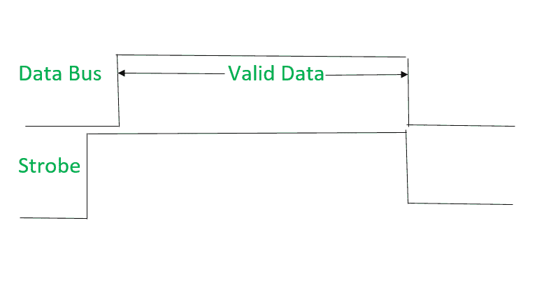
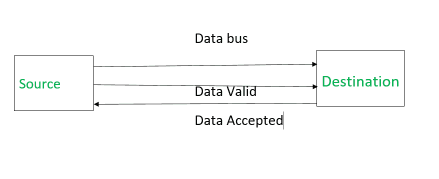
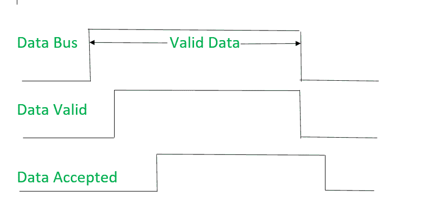
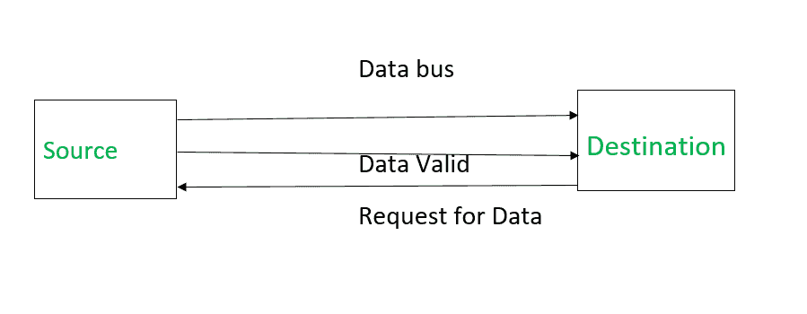
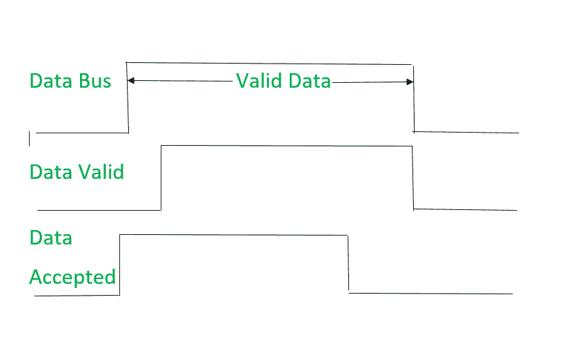

# 计算机组织|异步输入输出同步

> 原文:[https://www . geesforgeks . org/computer-organization-异步-输入-输出-同步/](https://www.geeksforgeeks.org/computer-organization-asynchronous-input-output-synchronization/)

异步输入输出是一种输入输出处理形式，允许其他设备在传输或数据传输完成之前进行处理。

**异步输入输出同步面临的问题–**
不确定数据总线上的数据是否新鲜，因为它们没有发送或接收数据的时隙。

这个问题通过以下机制解决:

1.  闸门
2.  握手

数据通过中间的数据总线从源传输到目的地。

**1。选通机构:**

1.  **Source initiated Strobe –** When source initiates the process of data transfer. Strobe is just a signal.

    

    (I)首先，source 将数据放在数据总线上，并开启选通信号。
    (ii)目的地在看到选通脉冲的接通信号时，从数据总线读取数据。
    (三)目的地从数据总线读取数据后，选通关闭。

    信号可视为:

    

    它显示第一个数据放在数据总线上，然后选通信号激活。

2.  **Destination initiated signal –** When destination initiates the process of data transfer.

    

    (I)首先，目的地接通选通信号，以确保源将新鲜数据放在数据总线上。
    (ii)源在看到接通信号时将新数据放在数据总线上。
    (三)目的地从数据总线读取数据，选通得到关闭信号。

    信号可视为:

    

    它显示第一个选通信号被激活，然后数据被放到数据总线上。

**基于 Strobe 的异步输入输出面临的问题–**

1.  在源启动的选通脉冲中，假设目的地已经从数据总线读取了数据，但是它们不能保证。
2.  在目的地启动的选通脉冲中，假设源已经将数据放在数据总线上，但是它们不能保证。

这个问题通过**握手**来克服。

**2。握手机制:**

1.  **Source initiated Handshaking –** When source initiates the data transfer process. It consists of signals:
    **DATA VALID:** if ON tells data on the data bus is valid otherwise invalid.
    **DATA ACCEPTED:** if ON tells data is accepted otherwise not accepted.

    

    (I)源将数据放在数据总线上，并使能数据有效信号。
    (ii)目的地接受来自数据总线的数据并启用数据接受信号。
    (iii)此后，禁用数据有效信号意味着数据总线上的数据现在无效。
    (iv)禁用数据接受信号，过程结束。

    现在可以肯定目的地已经通过数据接受信号从数据总线读取了数据。

    信号可视为:

    

    它显示首先将数据放在数据总线上，然后数据有效信号变为有效，然后数据接受信号变为有效。接受数据后，首先数据有效信号断开，然后数据接受信号断开。

2.  **Destination initiated Handshaking –** When destination initiates the process of data transfer.
    **REQUEST FOR DATA:** if ON requests for putting data on the data bus.
    **DATA VALID:** if ON tells data is valid on the data bus otherwise invalid data.

    

    (I)当目的地准备接收数据时，数据请求信号被激活。
    (ii)响应源将数据放在数据总线上，并使能数据有效信号。
    (iii)目的地然后接受来自数据总线的数据，并且在接受数据之后，禁用数据请求信号。
    (iv)最后，数据有效信号被禁用意味着数据总线上的数据不再是有效数据。

    现在可以肯定的是，信源已经通过数据有效信号把数据放到了数据总线上。

    信号可视为:

    

    它显示第一个数据请求信号激活，然后数据被放在数据总线上，然后数据有效信号激活。读取数据后，首先发出数据请求信号，然后发出数据有效信号。