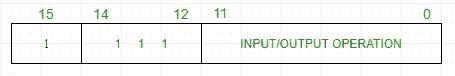

# 计算机组织|基本计算机指令

> 原文:[https://www . geesforgeks . org/computer-organization-basic-computer-instructions/](https://www.geeksforgeeks.org/computer-organization-basic-computer-instructions/)

基本计算机有 16 位指令寄存器，可以表示存储器参考或寄存器参考或输入输出指令。

1.  **Memory Reference –** These instructions refer to memory address as an operand. The other operand is always accumulator. Specifies 12-bit address, 3-bit opcode (other than 111) and 1-bit addressing mode for direct and indirect addressing.

    

    **例–**
    IR 寄存器包含= 0001XXXXXXXXXXXX，即取指令解码后的 ADD，我们发现它是进行 ADD 运算的内存引用指令。

    ```
    Hence, DR ← M[AR]
    AC ← AC + DR, SC ← 0
    ```

2.  **Register Reference –** These instructions perform operations on registers rather than memory addresses. The IR(14 – 12) is 111 (differentiates it from memory reference) and IR(15) is 0 (differentiates it from input/output instructions). The rest 12 bits specify register operation.

    

    **例–**
    IR 寄存器包含= 0111001000000000，即取解码周期后的 CMA 我们发现它是补码累加器的寄存器引用指令。

    ```
    Hence, AC ← ~AC
    ```

3.  **Input/Output –** These instructions are for communication between computer and outside environment. The IR(14 – 12) is 111 (differentiates it from memory reference) and IR(15) is 1 (differentiates it from register reference instructions). The rest 12 bits specify I/O operation.

    

    **例–**
    IR 寄存器包含= 1111100000000000，即取解码周期后的 INP 我们发现是输入字符的输入输出指令。因此，来自外围设备的输入字符。

包含在 16 位红外寄存器中的指令集包括:

1.  算术、逻辑和移位指令(和、加、补、左循环、右循环等)
2.  将信息移入和移出存储器(存储累加器，加载累加器)
3.  带有状态条件的程序控制指令(分支、跳过)
4.  输入输出指令(输入字符、输出字符)

| 标志 | 十六进制代码 | 描述 |
| --- | --- | --- |
| 和 | 0xx | 8xxx | 和存储字到交流 |
| 注意缺陷障碍 (Attention Deficit Disorder) | 1xx | 9xxx | 将记忆单词添加到交流 |
| 皱胃向左移 | 2xxx | Axxx | 将内存字加载到交流 |
| 无线电台临时使用许可证 | 3xxx | Bxxx | 将交流内容存储在内存中 |
| 小圆面包 | 4xxx | Cxxx | 无条件转移 |
| 农业科学学士(Bachelor of Science in Agriculture) | 5xx | Dxxx | 分支并保存返回地址 |
| ISZ | 6xx | Exxx | 如果为 0，递增并跳过 |
| 德国戴姆勒集团旗下品牌梅赛德斯 | Seven thousand eight hundred | 清除交流 |
| 小叶中心性肺气肿 | Seven thousand four hundred | 清除 E(溢出位) |
| 军事委员会(Committee of Military Affairs) | Seven thousand two hundred | 补码交流 |
| 芝加哥商业交易所(Chicago Mercantile Exchange) | Seven thousand one hundred | 补语 E |
| 圆圈(circle) | Seven thousand and eighty | 循环右空调和东空调 |
| 电立入逻辑 | Seven thousand and forty | 循环左空调和东空调 |
| 股份有限公司 | Seven thousand and twenty | 交流电增加 |
| 矿泉 | Seven thousand and ten | 如果交流> 0，跳过下一个指令 |
| 系统网络体系(System Network Architecture) | Seven thousand and eight | 如果 AC < 0，跳过下一条指令 |
| SZA | Seven thousand and four | 如果交流= 0，跳过下一条指令 |
| SZE | Seven thousand and two | 如果 E = 0，跳过下一条指令 |
| HLT | Seven thousand and one | 停止计算机 |
| 国际新闻照片社(International News Photos) | F800 | 交流输入字符 |
| 在外 | F400 | 交流输出字符 |
| 滑雪 | F200 | 输入时跳过标志 |
| SKO | F100 | 输出时跳过标志 |
| 离子 | F080 | 中断开启 |
| 眶下裂 | F040 | 中断关闭 |