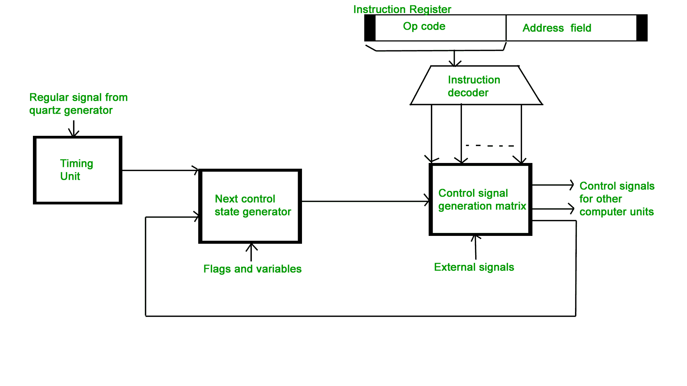
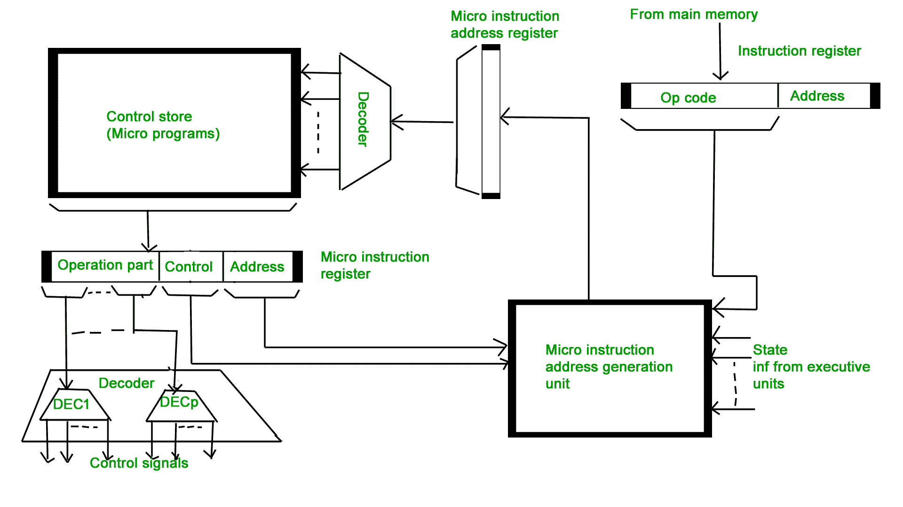

# 计算机组织|硬连线 v/s 微编程控制单元

> 原文:[https://www . geesforgeks . org/computer-organization-hardware-vs-micro-programed-control-unit/](https://www.geeksforgeeks.org/computer-organization-hardwired-vs-micro-programmed-control-unit/)

为了执行指令，中央处理器的控制单元必须以适当的顺序产生所需的控制信号。有两种方法用于以适当的顺序产生控制信号，即硬连线控制单元和微编程控制单元。

**硬连线控制单元–**
控制硬件可视为一个状态机，在每个时钟周期内从一种状态变为另一种状态，具体取决于指令寄存器、条件代码和外部输入的内容。状态机的输出是控制信号。该机器执行的操作顺序由逻辑元件的接线决定，因此被称为“硬接线”。

*   直接对应于布尔表达式的固定逻辑电路用于产生控制信号。
*   硬连线控制比微编程控制更快。
*   使用这种方法的控制器可以高速运行。
*   RISC 架构基于硬连线控制单元

**微编程控制单元–**

*   与操作相关的控制信号作为控制字存储在程序员无法访问的特殊存储单元中。
*   控制信号是由类似于机器语言程序的程序产生的。
*   微编程控制单元的速度较慢，因为从控制存储器中取出微指令需要时间。

**一些重要术语–**

1.  **控制字:**控制字是其各个位代表各种控制信号的字。
2.  **微例程:**对应于机器指令的控制序列的控制字序列构成该指令的微例程。
3.  **微指令:**这个微例程中的单个控制字称为微指令。
4.  **微程序:**微指令序列称为微程序，存储在称为控制存储器(CM)的 ROM 或 ram 中。
5.  **控制存储器:**计算机指令集中所有指令的微例程都存储在一个称为控制存储器的特殊存储器中。

**微编程控制单元的类型–**根据存储在控制存储器(CM)中的控制字的类型，将其分为两种类型:

**1。水平微编程控制单元:**
控制信号以 1 位/秒的解码二进制格式表示。示例:如果处理器中有 53 个控制信号，则需要 53 位。一次可以启用一个以上的控制信号。

*   它支持更长的控制字。
*   它用于并行处理应用。
*   它允许更高的并行度。如果度数为 n，则一次启用 n 个 CS。
*   它不需要额外的硬件(解码器)。这意味着它比垂直微程序快。
*   它比垂直微程序更灵活

**2。垂直微编程控制单元:**
控制信号以编码的二进制格式表示。对于 N 个控制信号，需要 Log2(N)位。

*   它支持较短的控制字。
*   它支持新控制信号的轻松实现，因此更加灵活。
*   它允许低并行度，即并行度不是 0 就是 1。
*   需要额外的硬件(解码器)来产生控制信号，这意味着它比水平微程序慢。
*   它不如水平控制单元灵活，但比硬连线控制单元灵活。

**GATE CS 角题**
练习下面的题有助于测试你的知识。所有的问题在前几年的 GATE 考试或 GATE 模拟考试中都被问过。强烈建议你练习一下。

1.  [GATE CS 2004，问题 66](https://www.geeksforgeeks.org/gate-gate-cs-2004-question-66/)
2.  [GATE CS 2002，问题 32](https://www.geeksforgeeks.org/gate-gate-cs-2002-question-32/)

**参考资料–**
[控制单元–维基百科](https://en.wikipedia.org/wiki/Control_unit)
[控制单元–edux . pjwstk . edu . pl](https://edux.pjwstk.edu.pl/mat/264/lec/main75.html)

本文由**维舍什巴派**供稿。如果你喜欢极客博客并想投稿，你也可以用 write.geeksforgeeks.org 写一篇文章或者把你的文章邮寄到 review-team@geeksforgeeks.org。看到你的文章出现在极客博客主页上，帮助其他极客。

如果你发现任何不正确的地方，或者你想分享更多关于上面讨论的话题的信息，请写评论。