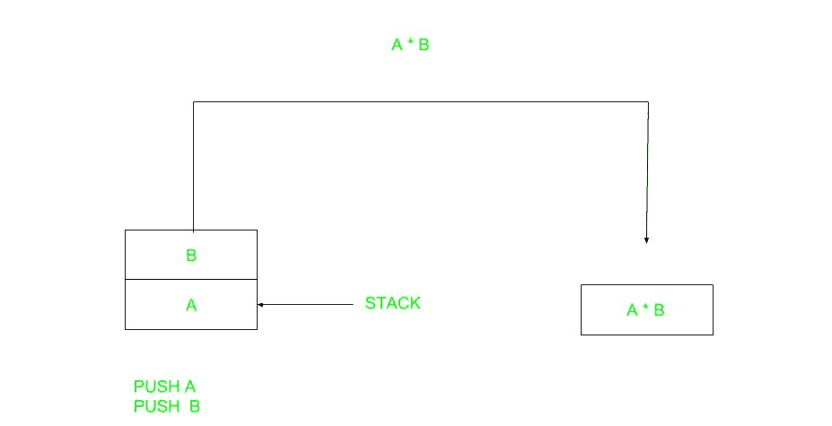
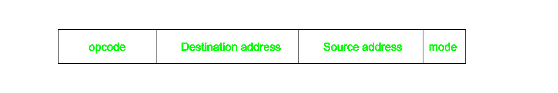
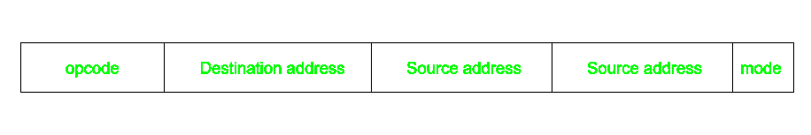

# 计算机组织|指令格式(零、一、二、三地址指令)

> 原文:[https://www . geesforgeks . org/computer-organization-instruction-formats-0123-address-instruction/](https://www.geeksforgeeks.org/computer-organization-instruction-formats-zero-one-two-three-address-instruction/)

计算机根据提供的指令执行任务。计算机中的指令由称为字段的组组成。这些字段包含不同的信息，对于计算机来说，一切都在 0 和 1 之间，因此每个字段都有不同的意义，中央处理器根据这些意义来决定执行什么。最常见的字段有:

*   操作字段指定要执行的操作，如加法。
*   包含操作数位置的地址字段，即寄存器或存储器位置。
*   指定如何创建操作数的模式字段。

指令的长度是可变的，取决于它包含的地址数量。通常，基于地址字段的数量，CPU 组织有三种类型:

1.  单一累加器组织
2.  普通注册机构
3.  栈结构

在第一种组织中，操作是通过一个称为累加器的特殊寄存器来完成的。其次，多个寄存器用于计算目的。在第三种组织中，基于堆栈的工作操作，因此它不包含任何地址字段。不需要应用单一的组织，我们通常看到的是各种组织的混合。

根据地址的数量，指令分为:

请注意，我们将使用 X = (A+B)*(C+D)表达式来展示该过程。

1.  **零地址指令–**



基于堆栈的计算机不使用指令中的地址字段。要计算一个表达式，首先要将其转换为逆波兰符号，即后缀符号。

```
Expression: X = (A+B)*(C+D)
Postfixed : X = AB+CD+*
TOP means top of stack
M[X] is any memory location
```

<figure class="table">

| 推 | A | TOP = A |
| 推 | B | TOP = B |
| 注意缺陷障碍 (Attention Deficit Disorder) |   | TOP = A+B |
| 推 | C | 顶部= C |
| 推 | D | TOP = D |
| 注意缺陷障碍 (Attention Deficit Disorder) |   | 顶部= C+D |
| MUL |   | TOP = (C+D)*(A+B) |
| 购买凭证（proof of purchase） | X | M[X] = TOP |

**2。一个地址指令–**
这使用一个隐含的累加器寄存器进行数据操作。一个操作数在累加器中，另一个在寄存器或存储单元中。隐含意味着 CPU 已经知道累加器中有一个操作数，所以不需要指定它。


```
Expression: X = (A+B)*(C+D)
AC is accumulator
M[] is any memory location
M[T] is temporary location
```

<figure class="table">

| 负荷 | A | 交流 = M[A] |
| 注意缺陷障碍 (Attention Deficit Disorder) | B | 交流 = 交流 + M[B] |
| 商店 | T | M[T] = 交流电 |
| 负荷 | C | 交流 = M[C] |
| 注意缺陷障碍 (Attention Deficit Disorder) | D | 交流 = 交流 + M[D] |
| MUL | T | 交流 = 交流 * M[T] |
| 商店 | X | M[X] = 交流 |

</figure>

**3。两个地址说明–**
这在商用计算机中很常见。这里可以在指令中指定两个地址。与之前的一条地址指令不同，结果存储在累加器中，这里的结果可以存储在不同的位置，而不仅仅是累加器，但是需要更多的位数来表示地址。



这里目的地址也可以包含操作数。

```
Expression: X = (A+B)*(C+D)
R1, R2 are registers
M[] is any memory location
```

<figure class="table">

| MOV | R1，阿 | R1 =男[女] |
| 注意缺陷障碍 (Attention Deficit Disorder) | R1 | R1 = R1 +地中海 |
| MOV | R2 | R2 = C |
| 注意缺陷障碍 (Attention Deficit Disorder) | R2 特区 | R2 = R2 + D |
| MUL | R2 R1 | R1 = R1 * R2 |
| MOV | 十、R1 | R1 |

</figure>

**4。三个地址指令–**
这有三个地址字段来指定寄存器或存储器位置。创建的程序在大小上要短得多，但是每条指令的位数增加了。这些指令使程序的创建变得容易得多，但这并不意味着程序将运行得更快，因为现在指令只包含更多的信息，但每个微操作(改变寄存器的内容、在地址总线中加载地址等)都包含更多的信息。)将只在一个周期内执行。



```
Expression: X = (A+B)*(C+D)
R1, R2 are registers
M[] is any memory location
```

<figure class="table">

| 注意缺陷障碍 (Attention Deficit Disorder) | R1，甲，乙 | R1 =甲+乙 |
| 注意缺陷障碍 (Attention Deficit Disorder) | 哥伦比亚特区 R2 | R2 =男[女] +男[女] |
| MUL | R2 R1 | R1 * R2 |

</figure>

</figure>