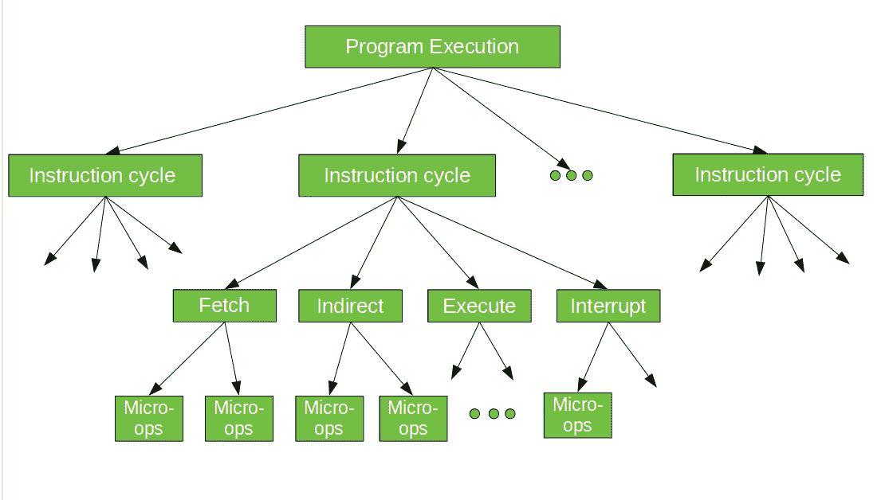

# 计算机组织|微操作

> 原文:[https://www . geesforgeks . org/computer-organization-micro-operation/](https://www.geeksforgeeks.org/computer-organization-micro-operation/)

在计算机中央处理器中，**微操作**(也称为微操作)是处理器的功能或原子操作。这些是低级指令，在一些设计中用于实现复杂的机器指令。它们通常对存储在一个或多个寄存器中的数据执行操作。它们在寄存器之间或中央处理器的外部总线之间传输数据，还对寄存器执行算术和逻辑运算。
在执行程序时，计算机的操作由一系列指令周期组成，每个周期有一条机器指令。每个指令周期由许多较小的单元组成–*获取、间接、执行和中断周期。*每个周期都涉及一系列步骤，每个步骤都涉及处理器寄存器。这些步骤被称为微操作。前缀 micro 指的是每个步骤都非常简单，完成的很少。下图描述了这里讨论的概念。

**概要:**程序的执行由指令的顺序执行组成。每个指令在由较短的子周期组成的指令周期内执行(例如，提取、间接、执行、中断)。每个子周期的执行涉及一个或多个较短的操作，即*微操作。*

在我的下一篇文章中，我将给出每个指令周期的详细信息。