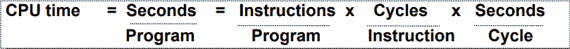

# 计算机组织|计算机性能

> 原文:[https://www . geesforgeks . org/computer-organization-performance-of-computer/](https://www.geeksforgeeks.org/computer-organization-performance-of-computer/)

**计算机性能**是计算机系统完成的工作量。计算机性能中的性能一词的意思是“计算机完成它应该完成的工作有多好？”。它基本上取决于计算机系统的响应时间、吞吐量和执行时间。

**响应时间**是任务从开始到完成的时间。这还包括:

*   操作系统开销。
*   等待输入/输出和其他进程
*   访问磁盘和内存
*   在 CPU 上执行所花费的时间或执行时间。

**吞吐量**是给定时间内完成的工作总量。

**CPU 执行时间**是 CPU 在给定任务上进行计算的总时间。它还排除了输入/输出或运行其他程序的时间。这也简称为 CPU 时间。

性能由执行时间决定，因为性能与执行时间成反比。

```
Performance = (1 / Execution time) 
```

而且，

```
(Performance of A /  Performance of B) 
= (Execution Time of B / Execution Time of A) 
```

如果给定处理器 A 比处理器 B 快，那就意味着 A 的执行时间比 B 的执行时间短，所以 A 的性能大于 B 的性能。

**示例–**
机器 A 在 100 秒内运行一个程序，机器 B 在 125 秒内运行相同的程序

```
(Performance of A /  Performance of B) 
= (Execution Time of B / Execution Time of A) 
= 125 / 100 = 1.25 
```

这意味着机器 A 比机器 b 快 1.25 倍。

并且，执行给定程序的时间可以计算为:

```
Execution time  = CPU clock cycles x clock cycle time 
```

因为时钟周期时间和时钟速率是倒数，所以，

```
Execution time  = CPU clock cycles / clock rate 
```

中央处理器时钟周期的数量可以由下式确定，

```
CPU clock cycles 
= (No. of instructions / Program ) x (Clock cycles / Instruction) 
= Instruction Count x CPI 
```

因此，

```
Execution time 
= Instruction Count x CPI x clock cycle time
= Instruction Count x CPI / clock rate  
```

中央处理器执行时间的单位是:



**如何提高绩效？**
要提高性能，您可以:

*   通过使用新硬件来降低 CPI(每条指令的时钟周期)。
*   通过减少传播延迟或使用流水线操作来减少时钟时间或提高时钟速率。
*   减少所需的周期数或改进 ISA 或编译器。