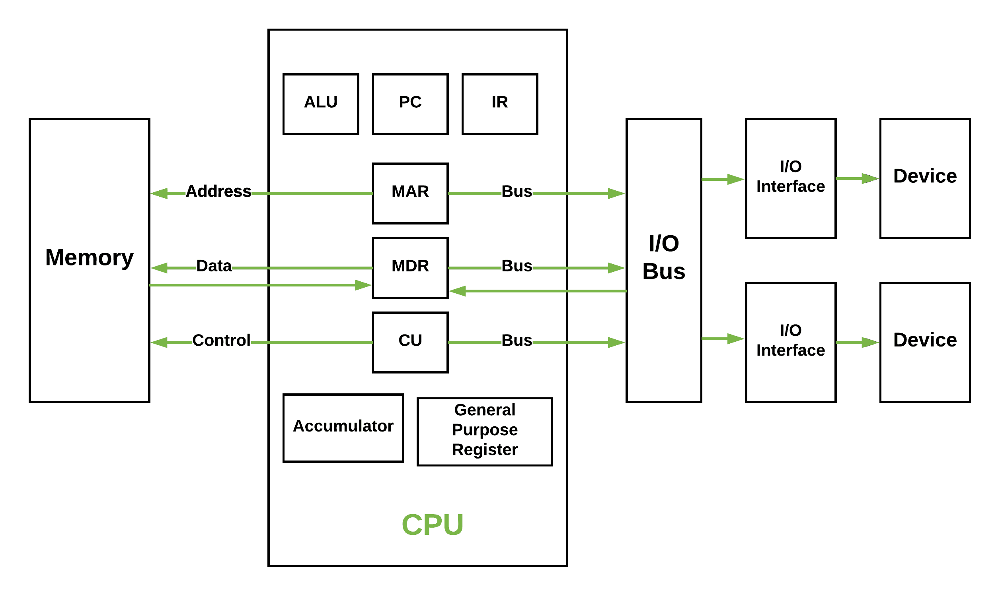

# 计算机组织|冯·诺依曼架构

> 原文:[https://www . geesforgeks . org/computer-organization-von-neumann-architecture/](https://www.geeksforgeeks.org/computer-organization-von-neumann-architecture/)

历史上有两种类型的计算机:

1.  **固定程序计算机–**它们的功能非常具体，无法编程，例如计算器。
2.  **存储程序计算机–**这些计算机可以被编程来执行许多不同的任务，应用程序存储在它们上面，因此得名。

现代计算机是基于约翰·冯·诺依曼提出的存储程序概念。在这种存储程序的概念中，程序和数据存储在一个单独的存储单元中，称为存储器，并被同等对待。这个新颖的想法意味着用这种架构构建的计算机将更容易重新编程。

基本结构是这样的，

它也被称为 **IAS** 计算机，有三个基本单位:

1.  中央处理器
2.  主存储单元
3.  输入输出设备

让我们详细考虑一下。

*   **控制单元–**
    控制单元(CU)处理所有处理器控制信号。它指导所有的输入和输出流，为指令获取代码，并控制数据如何在系统中移动。
*   **算术和逻辑单元(ALU)–**
    算术逻辑单元是中央处理器的一部分，处理中央处理器可能需要的所有计算，例如加法、减法、比较。它执行逻辑运算、移位运算和算术运算。

**图–**基本的中央处理器结构，说明算术逻辑单元

*   **主存储单元(寄存器)–**
    1.  **累加器:**存储算术逻辑单元的计算结果。
    2.  **程序计数器(PC):** 记录下一个要处理的指令的存储位置。然后，个人计算机将这个下一个地址传递给内存地址寄存器。
    3.  **内存地址寄存器(MAR):** 存储需要从内存中取出或存储到内存中的指令的内存位置。
    4.  **内存数据寄存器(MDR):** 它存储从内存中提取的指令或任何要传输到内存并存储在内存中的数据。
    5.  **当前指令寄存器(CIR):** 它存储最近提取的指令，同时等待编码和执行。
    6.  **指令缓冲寄存器(IBR):** 不立即执行的指令放在指令缓冲寄存器 IBR 中。

*   **输入/输出设备–**在中央处理器输入指令的控制下，程序或数据从*输入设备*或二级存储器读入主存储器。*输出设备*用于从计算机输出信息。如果一些结果由计算机评估并存储在计算机中，那么在输出设备的帮助下，我们可以将它们呈现给用户。
*   **总线–**数据通过总线从计算机的一个部分传输到另一个部分，将所有主要的内部组件连接到中央处理器和内存。类型:
    1.  **数据总线:**它在存储单元、输入/输出设备和处理器之间传输数据。
    2.  **地址总线:**它承载内存和处理器之间的数据(不是实际数据)的地址。
    3.  **控制总线:**它承载来自 CPU 的控制命令(以及来自其他设备的状态信号)，以便控制和协调计算机内的所有活动。

**冯·诺依曼瓶颈–**
无论我们做什么来提高性能，我们都离不开这样一个事实:指令一次只能做一个，只能按顺序执行。这两个因素都阻碍了中央处理器的能力。这通常被称为“冯·诺依曼瓶颈”。我们可以为冯·诺依曼处理器提供更多的高速缓存、更多的内存或更快的组件，但如果要在中央处理器性能上获得原始收益，就需要对中央处理器的配置进行有影响力的检查。

这种架构非常重要，并被用于我们的个人电脑，甚至超级计算机。