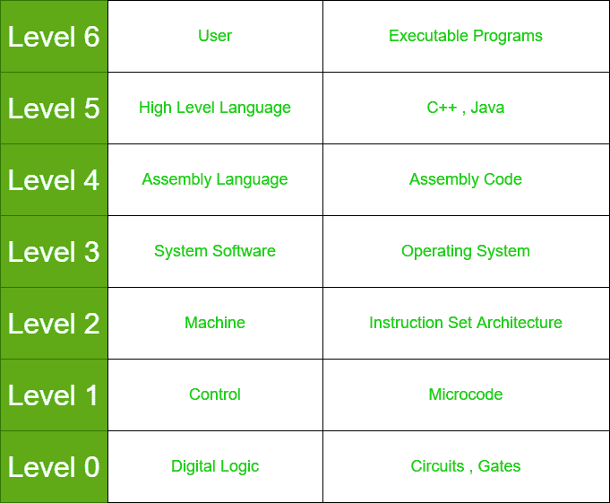

# 计算机系统级层次结构

> 原文:[https://www . geesforgeks . org/computer-system-level-hierarchy/](https://www.geeksforgeeks.org/computer-system-level-hierarchy/)

**计算机系统层次结构**是连接计算机和用户并利用计算机的不同层次的组合。它还描述了计算活动是如何在计算机上执行的，并显示了不同系统级别中使用的所有元素。

计算机系统层次结构由七个层次组成:

*   **Level-0:**
    与数字逻辑有关。数字逻辑是数字计算的基础，提供了对电路和硬件如何在计算机内通信的基本理解。它由各种电路和门等组成。
*   **等级-1:**
    这个等级和控制有关。控制是系统中使用微码的级别。控制单元包含在计算机系统的这个级别中。
*   **等级-2:**
    这个等级由机器组成。计算机系统中使用不同类型的硬件来执行不同类型的活动。它包含指令集体系结构。
*   **等级-3:**
    系统软件是这个等级的一部分。系统软件有各种类型。系统软件主要帮助操作该过程，并建立硬件和用户界面之间的连接。它可能由操作系统、库代码等组成。
*   **Level-4:**
    汇编语言是计算机系统的下一级。机器只理解汇编语言，因此，按照顺序，所有高级语言都在汇编语言中改变。汇编代码就是为它编写的。
*   **等级-5:**
    该等级的系统包含高级语言。高级语言由 C++、Java、FORTRAN 和许多其他语言组成。这是用户给出命令的语言。
*   **等级-6:**
    这是计算机系统层次结构的最后一级。这包括用户和可执行程序。