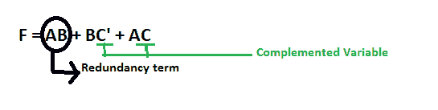
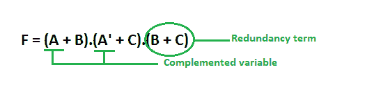

# 数字逻辑中的共识定理

> 原文:[https://www . geesforgeks . org/consensus-数字逻辑定理/](https://www.geeksforgeeks.org/consensus-theorem-in-digital-logic/)

先决条件–[布尔代数的属性](https://www.geeksforgeeks.org/mathematics-properties-boolean-algebra/)、[布尔函数的最小化](https://www.geeksforgeeks.org/digital-logic-minimization-boolean-functions/)

冗余定理被用作数字电子中的布尔代数技巧。它也被称为共识定理:

```
  AB + A'C + BC = AB + A'C
```

术语 AB 和 A'C 的共识或解决方案是 BC。它是所有术语的唯一文字的连词，不包括在一个术语中显得不必要而在另一个术语中被否定的文字。

这个方程的合取对偶是:

```
(A+B).(A'+C).(B+C) = (A+B).(A'+C)
```

在第二行中，我们省略了第三个产品术语 BC。这里，术语 BC 被称为冗余术语。这样，我们用这个定理来简化布尔代数。应用冗余定理的条件是:

1.  表达式中必须有三个变量。这里用 A、B、C 作为变量。
2.  每个变量重复两次。
3.  一个变量必须以补充形式出现。

应用这个定理后，我们只能取那些包含补变量的项。

**证明–**我们也可以这样证明:

```
Y = AB + A'C + BC
Y = AB + A'C + BC.1
Y = AB + A'C + BC.(A + A')
Y = AB + A'C + ABC + A'BC
Y = AB(1 + C) + A'C(1 + B)
Y = AB + A'C             
```

**例-1。**

```
F = AB + BC' + AC
```

这里，我们有三个变量 A，B 和 C，并且都重复了两次。变量 C 以补码的形式出现。因此，应用这个定理的所有条件都满足。



应用冗余定理后，我们可以只写包含补变量(即 C)的项，省略冗余项(即 AB)。

```
 .'. F = BC' + AC
```

**例-2。**

```
F = (A + B).(A' + C).(B + C)
```

存在三个变量，所有变量重复两次。变量 A 以补形式存在。因此，这个定理的三个条件都满足。



应用冗余定理后，我们可以只写包含补变量的项(即 A)，省略冗余项(即 B + C)。

```
.'. F = (A + B).(A' + C)
```

考虑以下等式:

```
Y = AB + A'C + BC
```

第三个产品术语 BC 是一个多余的共识术语。如果 A 从 1 切换到 0，而 B=1，C=1，Y 保持 1。在逻辑门中信号 A 的转变期间，第一项和第二项都可能瞬间为 0。第三项防止毛刺，因为在这种情况下，它的值 1 不受信号 a 转换的影响

因此。删除逻辑冗余很重要，因为它会导致不必要的网络复杂性，并提高实施成本。

这样，我们可以最小化一个布尔表达式来求解它。