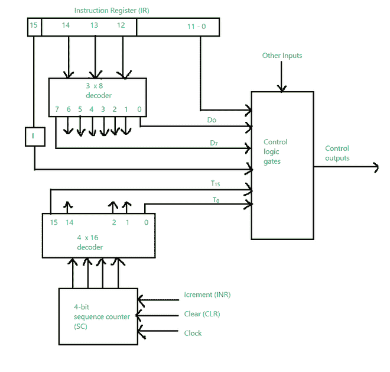

# 控制计算机组织中的逻辑门

> 原文:[https://www . geesforgeks . org/control-logic-gates-in-computer-organization/](https://www.geeksforgeeks.org/control-logic-gates-in-computer-organization/)

控制逻辑门是基本计算机的硬件组件。它包括一些输入和输出。下面给出的图表与硬连线控制组织有关。

下图由指令寄存器组成，该寄存器有三个部分:I 位(15)、操作码(12、13、14)和位 0 至 11。显示为 D 0 至 D 7 的符号为输出。符号 **I** 是触发器，它接收从位 15 传送的指令，位 0 到施加到控制逻辑门。计数器输出被解码成 T0 到 T15，它们是定时信号。

位 0 到 11 被放入控制逻辑门。

让我们看看控制逻辑门的输入和输出。

**控制逻辑门的输入来自:**

1.  两个解码器(一个是 3 × 8 解码器，另一个是 4 × 16 解码器)
2.  *I* 触发器
3.  指令寄存器的位 0 至 11

此外，它还包括一些其他输入:

1.  要检查的交流位 0 至 15(如果交流= 0)。它还将检测 AC=15 中的符号位。
2.  要检查的 DR 位 0 至 15(如果 DR = 0)。
3.  它还有 7 个人字拖的价值。

控制逻辑门

**控制逻辑门的输出为:**

1.  有信号检查九个寄存器的输入
2.  有信号检查存储器的读和写输入
3.  有信号来设置、清除或补充触发器
4.  信号 S2、S1 和 S0 用于选择总线寄存器
5.  检查交流加法器和逻辑电路的信号