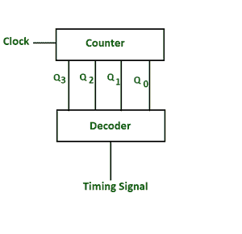
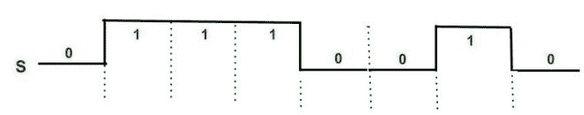
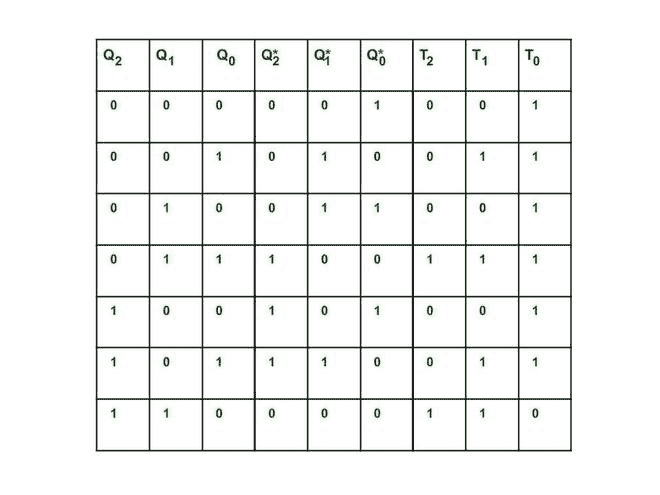
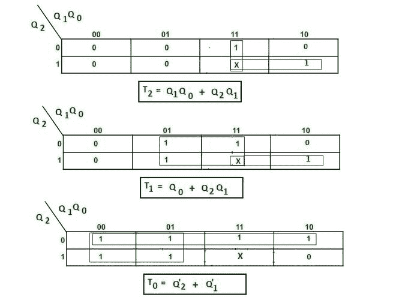
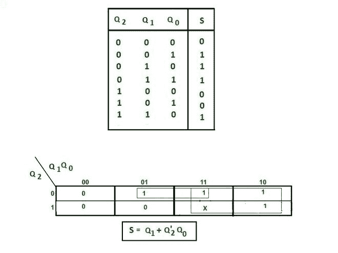
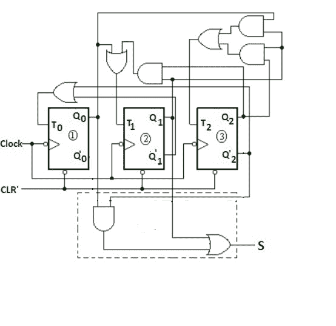
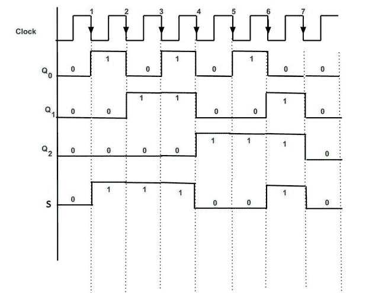

# 使用计数器产生控制信号

> 原文:[https://www . geesforgeks . org/control-signal-generation-use-counter/](https://www.geeksforgeeks.org/control-signals-generation-using-counter/)

*   在各种数字应用中(例如:硬连线控制单元)，需要控制信号以特定的时间顺序启动、执行和步进各种操作。
*   为此需要控制信号，并且为了产生控制信号，设计了计数器电路，其输出连接到解码器。解码器提供所需的控制信号。
*   计数器可以是同步的，也可以是异步的。
*   计数器的设计程序相同(参考[这个](https://www.geeksforgeeks.org/3-bit-synchronous-down-counter/))。

**控制信号产生框图**

控制信号的设计可以通过考虑例子来理解。
**示例–**生成一个控制信号，该信号可以传送以下脉冲序列。脉冲序列将在 7 个脉冲后重复。

**控制信号**

这里我们需要产生一个控制信号(比如 S)，它可以产生 **0111001** 的周期脉冲序列，然后重复。脉冲序列在 7 个脉冲后重复。因此，需要 **mod -7 计数器。**Mod-7 计数器的输出将连接到解码器电路。为此，将设计一个 mod–7 计数器。需要三次 T 翻转(因为我们需要从 000 数到 110，所以需要 3 位)。
关于 Mod-N 计数器的设计，请参考本文。

**mod-7 计数器的设计–**
这里 Q 是上一个状态，Q*是下一个状态。

**mod-7 计数器的电路激励表**

T 触发器的输入表达式从如下所示的 K 图中获得。

**解码器的真值表是通过观察给定的时序(0111001** )获得的。解码器输出 S 的简化表达式是用 K 图得到的。未使用的计数被视为不关心。
每个计数序列被映射到一个控制信号位。
通过求解 K 图可以找到解码器的组合逻辑。

解码器电路的简化表达式为:S = Q1+Q’2Q0。
**例——**当我们处于状态 Q2= 0 Q1= 0 Q0= 0 时，那么 S 的值= 0+0.1= 0。

**带解码器的完整逻辑图。**

解码器电路在每个时钟(-ve 边沿触发)脉冲后产生输出。输出即信号将作为其他电路的控制信号。

控制信号的产生发生在每个负沿时钟之后，并且这种控制信号的时序图也可以如下所示绘制。每个计数器状态用于产生一个控制信号。

**计数器产生控制信号 S 的时序图**