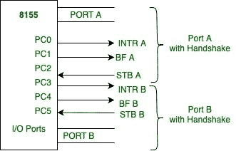

# 8155 微处理器中的控制信号

> 原文:[https://www . geesforgeks . org/control-signals-in-8155-微处理器/](https://www.geeksforgeeks.org/control-signals-in-8155-microprocessor/)

在握手模式下，当端口 A 和 B 都配置好后，端口 A 使用端口 C 的下面三个信号(即 PC0、PC1、PC2)，端口 B 使用上面三个信号(即 PC3、PC4、PC5)。

图表如下:

**Figure –** 8155 with Handshake mode

上述信号的功能如下:

1.  **STB(选通脉冲输入):**
    这是一个输入握手信号。这是从外设连接到 8155。该信号的低电平通知 8155 数据选通输入端口。
2.  **BF(缓冲区已满):**
    这是一个高电平有效信号，基本上表示端口中存在一个数据字节。
3.  **INTR(中断请求):**
    从名称本身可以清楚地看出，**机顶盒**信号的上升沿产生该信号。每当中断触发器**(INT)**被使能时，就会发生这种情况。这可以用来中断微处理器。
4.  **INT(中断使能):**
    这是一个内部触发器，用于启用或禁用 8155 的中断功能。端口 A 和端口 B 的中断分别由控制寄存器中的位 D4 和 D5 控制。

这些控制信号可以用来实现中断输入输出或状态检查输入输出