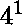
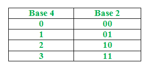
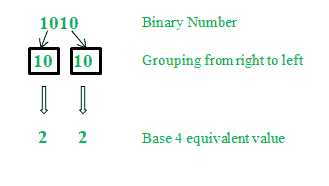
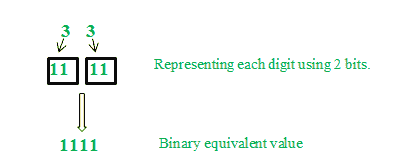

# 二进制数到 4 进制的转换

> 原文:[https://www . geeksforgeeks . org/二进制数到 4 进制数的转换/](https://www.geeksforgeeks.org/conversion-of-binary-number-to-base-4-system/)

我们都知道， = 。
换句话说，基数 4 的一位数可以用基数 2 的二位数来表示。基数 2 有数字 0 和 1。类似地，基数 4 有数字 0、1、2 和 3。



**二进制到四进制转换的算法**

1.  从右开始，将二进制数(基数为 2)的数字分组为两组。
2.  写出每组对应的基数为 4 的等值。

**示例:**将二进制数 1010 转换为基数 4。



因此二进制数 1010 的 4 进制等效值是 22。

现在，4 进制到二进制转换的算法:用 2 位表示 4 进制数中的每个数字。

**示例:**将基数为 4 的数字 22 转换为二进制。



因此，基数为 4 的 22 的二进制等价数是 1010。

**练习题:**
(1)将二进制数 111000 转换为基数 4。
(2)将二进制数 100100 转换为基数 4。
(3)将二进制数 1001001111 转换为基数 4。
(4)基数为 4 的数 3333 的二进制等价数是多少。
(5)4 进制数 111303 的二进制等价数是多少。

**答案:**

```
(1) 320
(2) 210
(3) 21033
(4) 11111111
(5) 10101110011
```