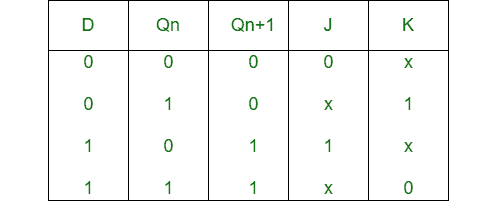
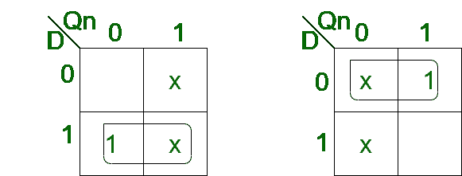
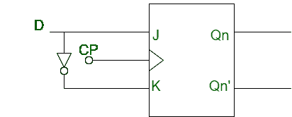

# J-K 触发器到 D 触发器的转换

> 原文:[https://www . geeksforgeeks . org/转换-j-k-触发器到-d-触发器/](https://www.geeksforgeeks.org/conversion-of-j-k-flip-flop-into-d-flip-flop/)

先决条件–[触发器](https://www.geeksforgeeks.org/flip-flop-types-their-conversion-and-applications/)

**1。JK 触发器:**
JK 触发器基本上是一个门控 SR 触发器，它有一个额外的输入，即时钟输入。它防止两个输入都为 1 时可能获得的无效输出。

**2。D 触发器:**
D 触发器是一种带有附加反相器的改进型 SR 触发器。它防止输入变成相同的值。

**J-K 触发器到 D 触发器的转换:**

*   **Step-1:**
    We construct the characteristic table of D flip-flop and excitation table of JK flip-flop.

    

*   **Step-2:**
    Using the K-map we find the boolean expression of J and K in terms of D.

    

    ```
    J = D
    K = D' 
    ```

*   **Step-3:**
    We construct the circuit diagram of the conversion of JK flip-flop into D flip-flop.

    