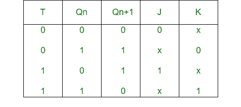
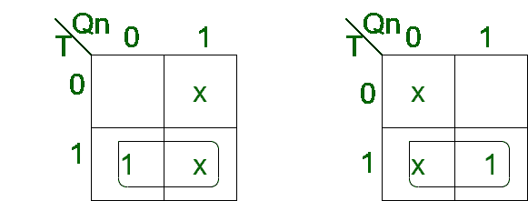
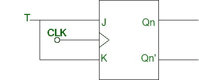

# J-K 触发器到 T 触发器的转换

> 原文:[https://www . geeksforgeeks . org/转换-j-k-触发器到-t-触发器/](https://www.geeksforgeeks.org/conversion-of-j-k-flip-flop-into-t-flip-flop/)

先决条件–[触发器](https://www.geeksforgeeks.org/flip-flop-types-their-conversion-and-applications/)

**1。J-K 触发器:**
J-K 触发器是 Sr 触发器的门控版本，增加了额外的输入，即时钟输入。当两个输入值相同时，它防止无效的输出条件。

**2。T 触发器:**
T 触发器的意思是 Toggle 触发器。它在每个时钟沿改变输出，并向输入端提供信号频率一半的输出。

**J-K 触发器到 T 触发器的转换:**

*   **Step-1:**
    Construct the characteristic table of T flip-flop and excitation table of J-K flip-flop.

    

*   **Step-2:**
    Using K map, find the boolean expression for J and K in terms of T.

    

    ```
    J = T
    K = T 
    ```

*   **Step-3:**
    Construct the circuit diagram for the conversion of J-K flip-flop into T flip-flop.

    