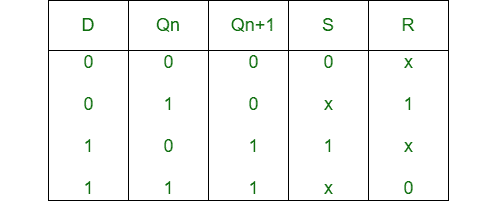
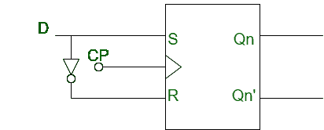

# S-R 触发器到 D 触发器的转换

> 原文:[https://www . geeksforgeeks . org/s-r-触发器到 d-触发器的转换/](https://www.geeksforgeeks.org/conversion-of-s-r-flip-flop-into-d-flip-flop/)

先决条件–[触发器](http://Flip-flop)

**1。S-R 触发器:**
S-R 触发器类似于 S-R 锁存器的期望时钟信号和两个与门。该电路响应输入 S 和 r 的时钟脉冲的正沿

**2。D 触发器:**
D 触发器是一种带有附加反相器的改进型 SR 触发器。它防止输入变成相同的值。

**S-R 触发器向 D 触发器的转换:**

*   **Step-1:**
    We construct the characteristic table of D flip-flop and excitation table of S-R flip-flop.

    

*   **Step-2:**
    Using the K-map we find the boolean expression of S and R in terms of D.

    

    ```
    S = D
    R = D' 
    ```

*   **Step-3:**
    We construct the circuit diagram of the conversion of S-R flip-flop into D flip-flop.

    