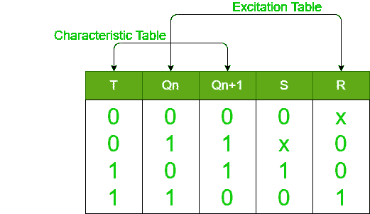
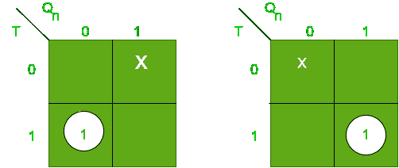
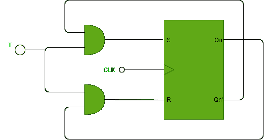

# S-R 触发器转换为 T 触发器

> 原文:[https://www . geeksforgeeks . org/s-r-触发器到 t-触发器的转换/](https://www.geeksforgeeks.org/conversion-of-s-r-flip-flop-into-t-flip-flop/)

先决条件–[触发器](https://www.geeksforgeeks.org/flip-flop-types-and-their-conversion/)
在这里，我们将通过一个例子来讨论 S-R 触发器转换为 T 触发器的过程。

**转换规则:**

*   **步骤-1:**
    找到所需触发器的特性表和现有(给定)触发器的激励表。
*   **第 2 步:**
    用 K-map 求出给定触发器在所需触发器方面的表达式。
*   **第三步:**
    找到所需触发器的电路图。

**S-R 触发器到 T 触发器:**
下面是 T 触发器的特性表和 S-R 触发器的激励表。

现在，使用 K 图，我们得到了 S & R 的表达式

**s = tqn**&**【r = tqn】**

因此，S-R 触发器转换为 T 触发器的电路图为:

