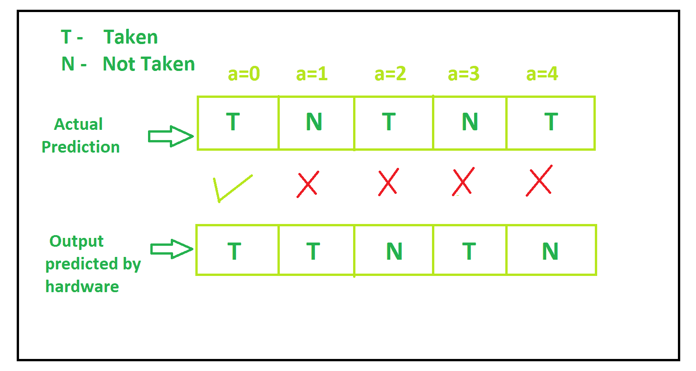
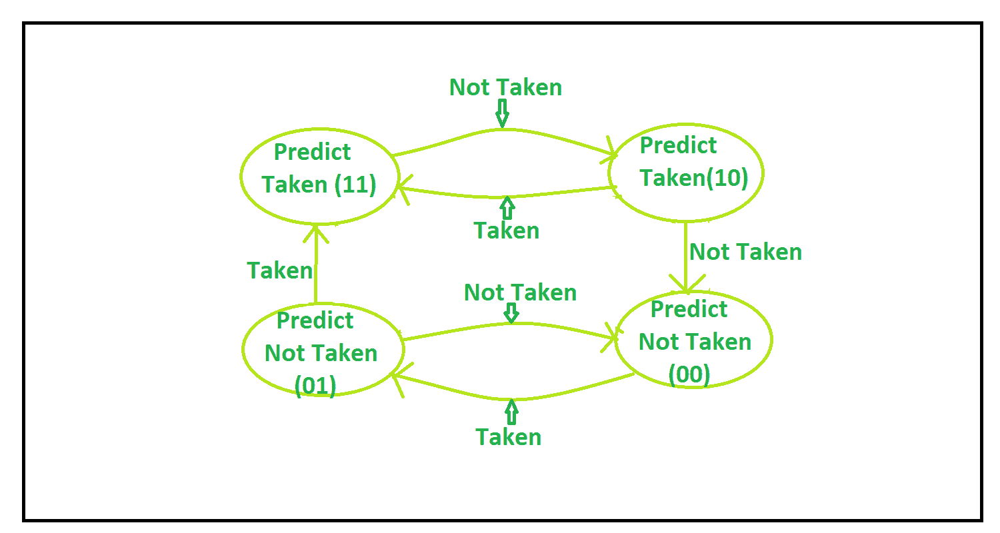
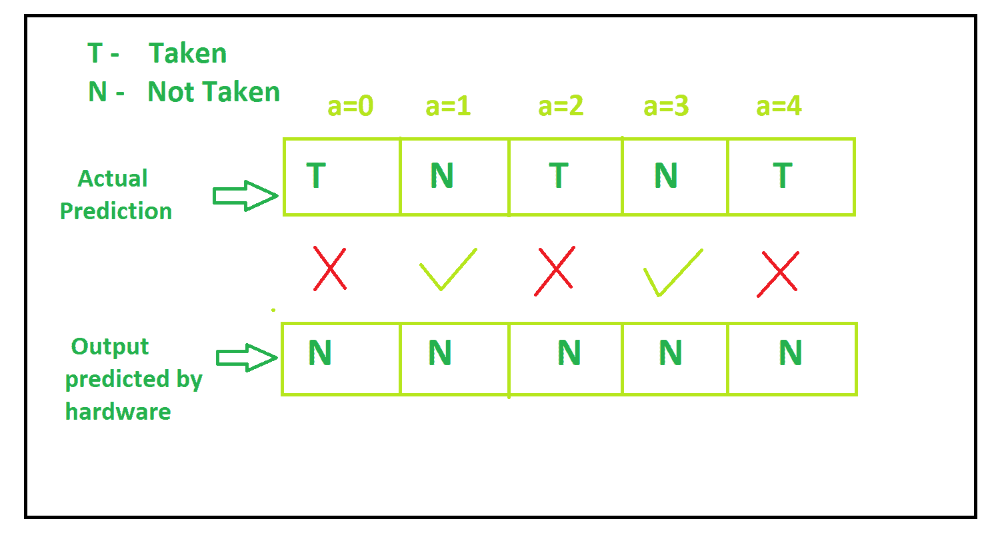
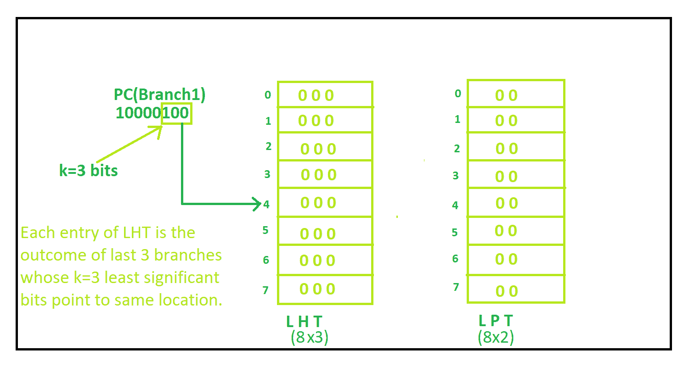
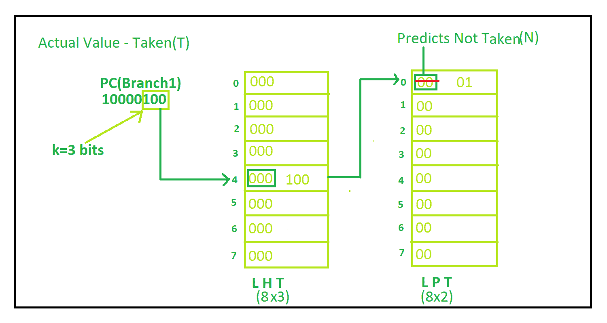
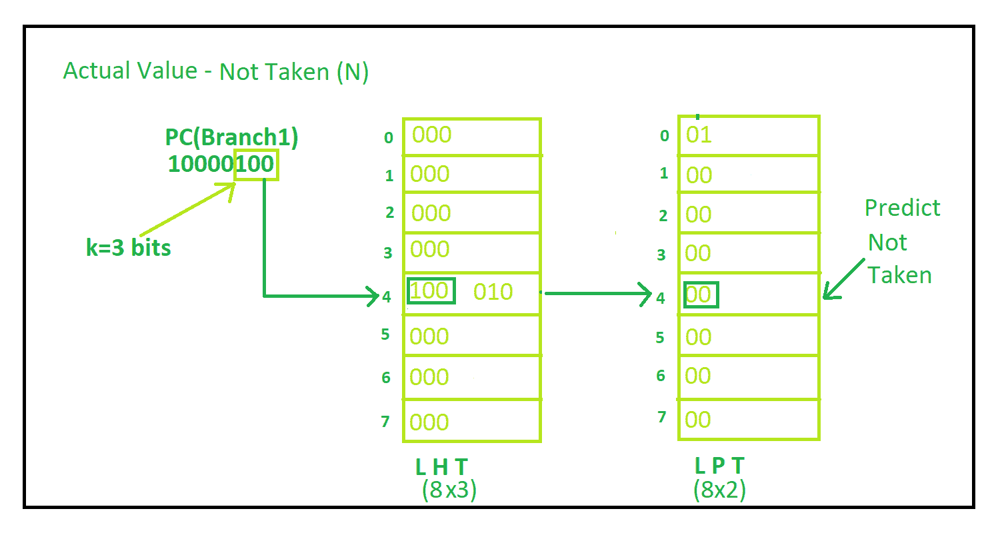
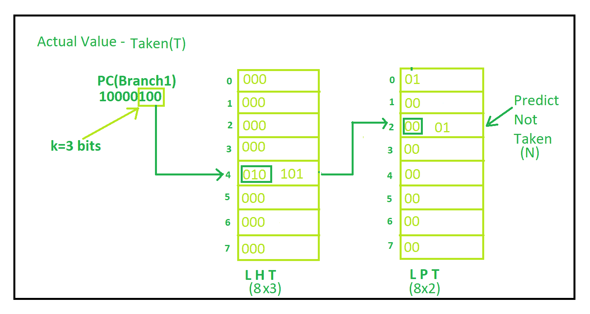
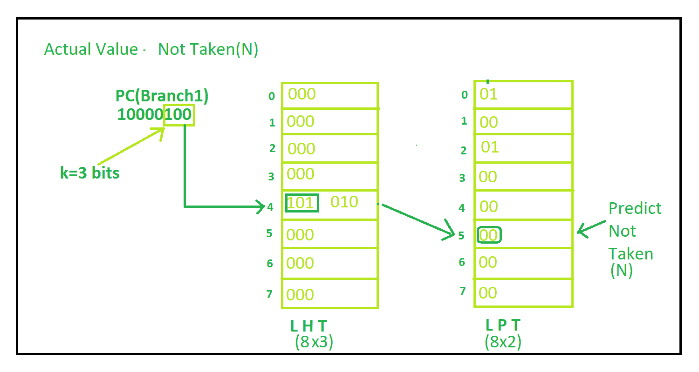
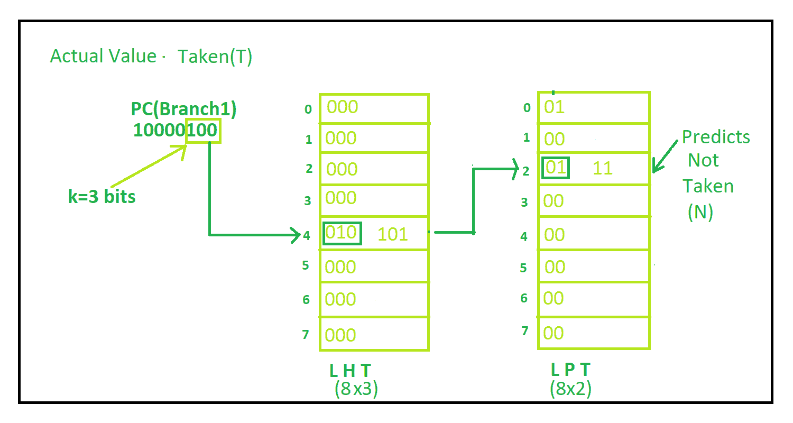
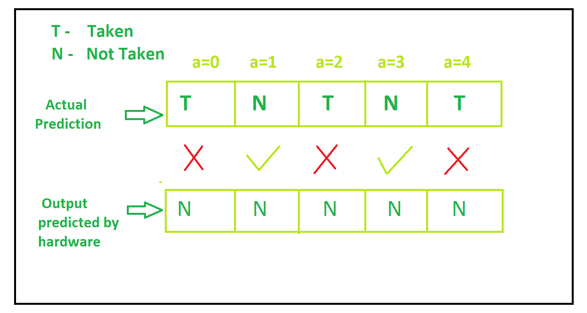

# 关联分支预测

> 原文:[https://www . geeksforgeeks . org/correlating-branch-prediction/](https://www.geeksforgeeks.org/correlating-branch-prediction/)

程序中存在的条件分支会显著影响系统的性能。因此，我们需要提出有效的分支预测机制，以获得高精度的分支目标地址，从而最大限度地减少与控制风险相关的停顿。

如果未能正确预测目标地址，将会在刷新流水线和将处理器恢复到执行分支指令时的状态方面出现损失。

**分支预测技术的类型–**
分支预测技术可以有两种类型:

1.  静态分支预测技术
2.  动态分支预测技术

这些解释如下。

**1。静态分支预测技术:**
在静态分支预测技术的情况下，底层硬件假设要么分支不总是被采用，要么分支总是被采用。
让我们用一个示例代码来理解分支预测:

```
//Code
int a=0;
while(a<5)
  {
    //branch instruction, condition either true or false
    if(a%2==0)   
    {.....}
    a++;
  }
```

**输出–**
让我们假设底层硬件已经假设分支并不总是被采用。底层硬件预测的输出和实际输出如图所示:


**2。动态分支预测技术:**
在动态分支预测技术中，底层硬件的预测不是固定的，而是动态变化的。该技术比静态技术具有更高的精度。

一些动态分支预测技术有:

1.  1 位分支预测技术
2.  2 位分支预测技术
3.  相关分支预测技术

这些解释如下。

*   **1-bit Branch Prediction Technique –**
    In this technique hardware changes its assumption just after one false assumption.For example if hardware assumes branch to be taken but actually branch is not taken, then in next step hardware assumes branch to be not taken and vice-versa.

    1 位分支预测机如下图所示:

    

    **解释–**
    首先，假设硬件假设分支被取，那么在 a=0 时，分支被取。在 a=1 时，硬件假设采取分支，但不采取分支。因此，现在在 a=2，硬件假设不采取分支，而是采取分支。在 a=3 时，硬件假设采取分支，但不采取分支。在 a=4 时，硬件假设不采取分支，但采取分支。

    底层硬件预测的输出和实际输出如图所示:

    

*   **2-bit Branch Predictor –**
    In this technique the underlying hardware does not changes itss assumption just after one incorrect assumption, rather it changes its assumption after two consecutive wrong assumption and vice-versa.

    2 位分支预测机如图所示:

    

    **解释–**

    1.  假设当 a=0 时，所有内容都被重置(00)，因此硬件假设不采取分支，而采取分支。所以目前的状态是(01)
    2.  当 a=1 时，硬件假设不采取分支，也不采取分支。所以当前状态是(00)
    3.  当 a=2 时，硬件假设不采取分支，而采取分支。所以当前状态是(01)
    4.  当 a=3 时，硬件假设不采取分支，也不采取分支。所以当前状态是(10)
    5.  当 a=4 时，硬件假设不采取分支，而采取分支。所以当前状态是(00)

    底层硬件预测的输出和实际输出如图所示:

    

*   **Correlating Branch Prediction –**
    We cannot get significant accuracy from 2-bit branch predictor also due to interference with other branches.So correlating branch prediction comes into picture which is also known as two-level branch predictor in which prediction accuracy is improved as it takes into consideration the recent behavior of other branches also.

    **信息来源–**

    *   它使用之前提取的分支目标地址的 k 个最低有效位。
    *   它还使用本地历史表(LHH)，这是移位寄存器表，其中移位寄存器指具有相同 k 个最低有效位的 m 个分支的最后结果。
    *   它还使用本地预测表根据其所处的状态来预测结果。

    **示例–**
    让我们用同一个示例来说明和理解这种预测技术。

    

    **讲解循序渐进–**
    **1。**最小 k(这里 k=3)有效位是 100，即 4，因此这指向本地历史表中的位置 4。在位置 4，它包含 000，即 0，因此它指向本地预测表中的位置 0。它包含状态 00，即分支未被采用，但实际上分支(0%2)被采用。所以现在两个表都更新了。
    完整流程如图:

    

    **2。**在位置 4，现在它在本地历史表中包含 100，所以它指向本地预测表中的位置 4。它包含状态 00，即分支未被采用，实际上分支未被采用。因此相应地，表被更新。
    完整流程如图:

    

    **3。** t 位置 4 现在它在本地历史表中包含 010，所以它指向本地预测表中的位置 2。它包含状态 00，即未采取分支，实际上采取了分支。因此相应地，表被更新。
    完整流程如图:

    

    **4。**位置 4，现在在 Local 历史表中包含 101，所以指向 Local 预测表中的位置 5。它包含状态 00，即未采取分支，实际上未采取分支。因此相应的表格得到更新
    完整的流程如图所示:

    

    **5。**现在位置 4 在本地历史表中包含 010，因此它指向本地预测表中的位置 2。它包含状态 01，即未采取分支，实际上采取了分支。因此相应的表格得到更新
    完整的流程如图所示:

    

    底层硬件预测的输出和实际输出如图所示:

    

    因此，如果有一个以上的分支，并且过程像这样继续，相关分支预测比所有技术给出最高的准确性。