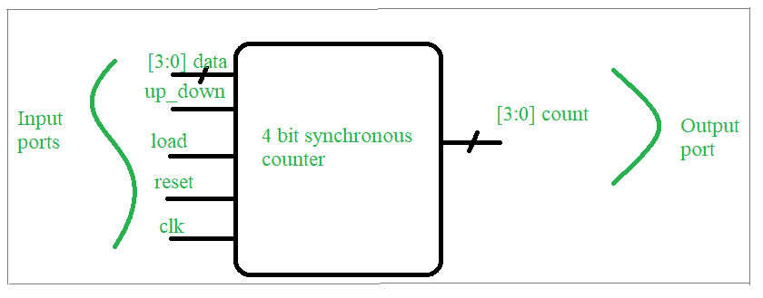

# 使用 verilog HDL 的计数器设计

> 原文:[https://www . geesforgeks . org/counter-design-use-verilog-HDL/](https://www.geeksforgeeks.org/counter-design-using-verilog-hdl/)

**先决条件–**[数字逻辑中的计数器](https://www.geeksforgeeks.org/counters-in-digital-logic/)

**问题:**
设计 4 位上下同步计数器 Verilog 硬件描述语言和测试平台

**设计规格:**



设计要求框图:4 位计数器

计数器是一个**数字时序电路**，这里是一个 4 位计数器，简单的说就是根据计数的方向(上/下)，可以从 0 计数到 15，反之亦然。

*   计数器(“ *count* ”)值将在时钟(“ *clk* ”)周期的每个正(上升)沿进行评估。
*   当*复位*输入为逻辑高时，计数器将设置为零。
*   当*加载*信号为逻辑高时，计数器将加载*数据*输入。否则，它将向上或向下计数。
*   当“ *up_down* ”信号为逻辑高电平时，计数器将向上计数，否则向下计数。

**Verilog 高密度脂蛋白代码:**

**设计–**

```
// Here we will learn to write a verilog HDL to design a 4 bit counter
module counter(clk,reset,up_down,load,data,count);
  //define input and ouput ports
  input clk,reset,load,up_down;
 input [3:0] data;
 output reg [3:0] count;
  //always block will be executed at each and every positive edge of the clock
  always@(posedge clk) 
  begin
    if(reset)    //Set Counter to Zero
      count <= 0;
    else if(load)    //load the counter with data value
      count <= data;
    else if(up_down)        //count up
      count <= count + 1;
    else            //count down
      count <= count - 1;
  end
endmodule :counter
```

**测试台:**

```
// Code your testbench here
module counter_tb;
  reg clk,reset,load,ud;
  reg [3:0] data;
  wire [3:0] count;
  // instance counter design
  counter ct_1(.ud(up_down),.*);
  //clock generator
  initial begin clk = 1'b0; repeat(30) #3 clk= ~clk;end
  //insert all the input signal
  initial begin reset=1'b1;#7 reset=1'b0; #35 reset=1'b1;end
  initial begin #12 load=1'b1; #5 load=1'b0;end
  initial begin #5 ud=1'b1;#24 ud=1'b0;end
  initial begin data=4'b1000;#14 data=4'b1101;#2 data=4'b1111;end
  //monitor all the input and output ports at times when any inputs changes its state
  initial begin $monitor("time=%0d,reset=%b,load=%b,ud=%b,data=%d,count=%d",
                               $time,reset,load,ud,data,count);end
endmodule :counter_tb
```

**预期输出:**

```
time=0,reset=1,load=x,ud=x,data= 8,count= x
time=3,reset=1,load=x,ud=x,data= 8,count= 0
time=5,reset=1,load=x,ud=1,data= 8,count= 0
time=7,reset=0,load=x,ud=1,data= 8,count= 0
time=9,reset=0,load=x,ud=1,data= 8,count= 1
time=12,reset=0,load=1,ud=1,data= 8,count= 1
time=14,reset=0,load=1,ud=1,data=13,count= 1
time=15,reset=0,load=1,ud=1,data=13,count=13
time=16,reset=0,load=1,ud=1,data=15,count=13
time=17,reset=0,load=0,ud=1,data=15,count=13
time=21,reset=0,load=0,ud=1,data=15,count=14
time=27,reset=0,load=0,ud=1,data=15,count=15
time=29,reset=0,load=0,ud=0,data=15,count=15
time=33,reset=0,load=0,ud=0,data=15,count=14
time=39,reset=0,load=0,ud=0,data=15,count=13
time=42,reset=1,load=0,ud=0,data=15,count=13
time=45,reset=1,load=0,ud=0,data=15,count= 0
```

**注:**跟随此[链接](https://www.edaplayground.com/x/eQ69)在线模拟此设计。