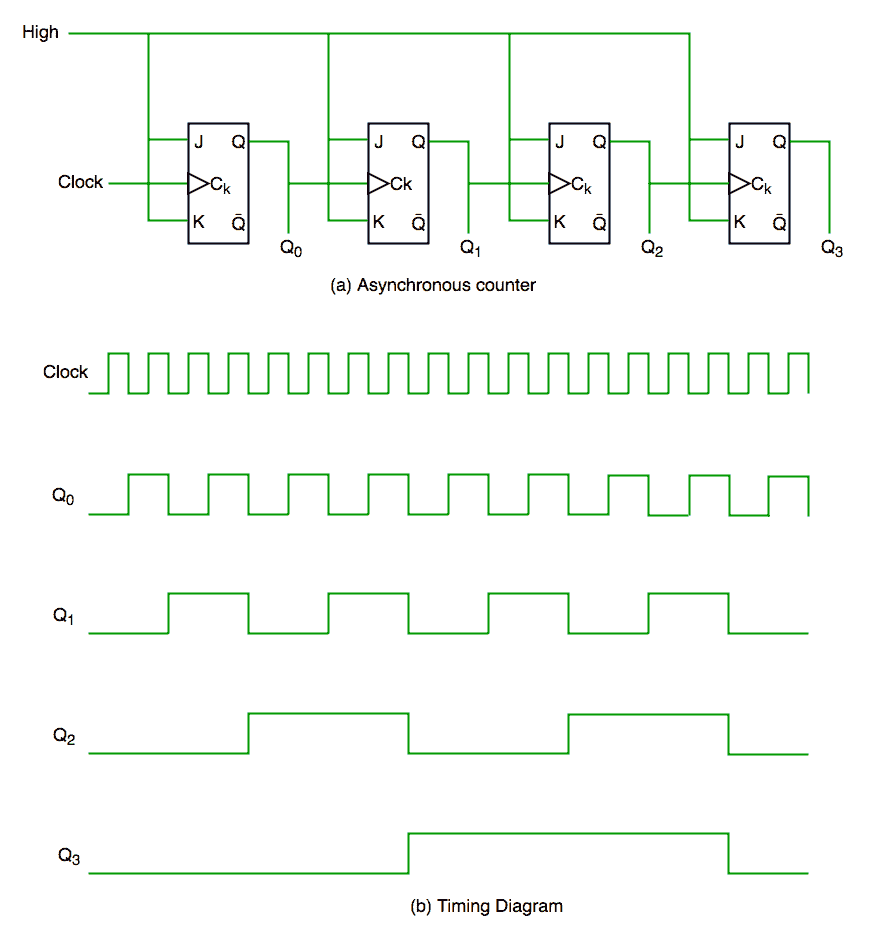
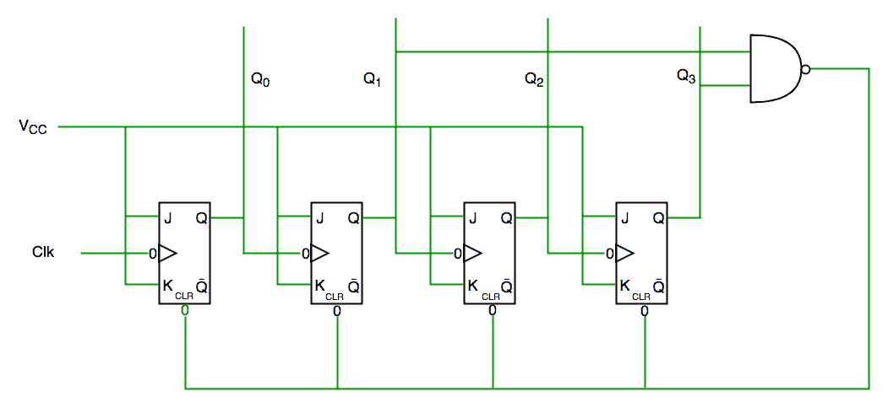
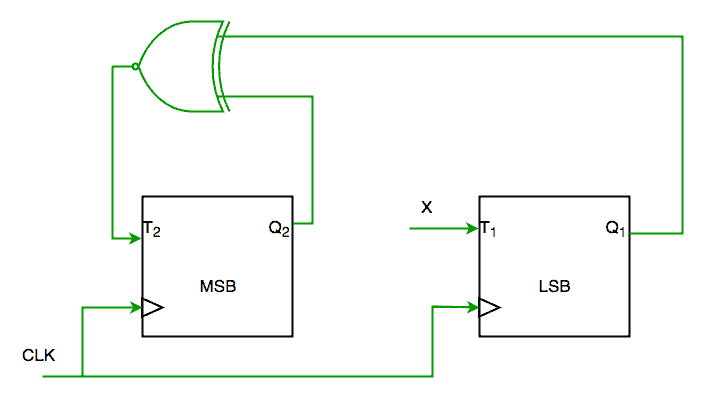

# 数字逻辑中的计数器

> 原文:[https://www.geeksforgeeks.org/counters-in-digital-logic/](https://www.geeksforgeeks.org/counters-in-digital-logic/)

根据维基百科，在数字逻辑和计算中，一个[**C****counter**](https://en.wikipedia.org/wiki/Counter_(digital))是一个存储(有时显示)特定事件或过程发生次数的设备，通常与时钟信号有关。计数器在数字电子中用于计数目的，它们可以计数电路中发生的特定事件。例如，在上行计数器中，计数器在时钟的每个上升沿增加计数。不仅仅是计数，计数器可以按照我们设计的特定顺序，像任何随机序列 0，1，3，2…它们也可以借助人字拖来设计。

**<u>计数器分类</u>**

计数器大致分为两类

1.  异步计数器
2.  同步计数器

1. **<u>【异步计数器】</u>**

在异步计数器中，我们不使用通用时钟，只有第一个触发器由主时钟驱动，其余后续触发器的时钟输入由前一个触发器的输出驱动。我们可以通过下图来理解- 

从时序图中可以明显看出，一旦遇到时钟脉冲的上升沿，Q0 就会发生变化，当遇到 Q0 的上升沿时，Q1 就会发生变化(因为 Q0 就像第二触发器的时钟脉冲)等等。这样，通过 Q0、Q1、Q2、Q3 产生波纹，因此也称为**波纹计数器。**

2. **<u>同步计数器</u>**

与异步计数器不同，同步计数器有一个全局时钟来驱动每个触发器，因此输出并行变化。同步计数器相对于异步计数器的一个优点是，它可以在比异步计数器更高的频率上工作，因为它没有累积延迟，因为每个触发器都有相同的时钟。

**同步计数器电路**

**时序图同步计数器**

从电路图中我们可以看到，Q0 位给出了时钟每个下降沿的响应，而 Q1 依赖于 Q0，Q2 依赖于 Q1 和 Q0，Q3 依赖于 Q2、Q1 和 Q0。

****<u>十年计数器</u>**T5】**

十进制计数器计数十种不同的状态，然后复位到初始状态。一个简单的十进制计数器将从 0 计数到 9，但是我们也可以使十进制计数器在 0 到 15 之间经历任何十个状态(对于 4 位计数器)。

| 时钟脉冲 | Q3 | Q2 | 雌三醇环戊醚 | Q0 |
| Zero | Zero | Zero | Zero | Zero |
| one | Zero | Zero | Zero | one |
| Two | Zero | Zero | one | Zero |
| three | Zero | Zero | one | one |
| four | Zero | one | Zero | Zero |
| five | Zero | one | Zero | one |
| six | Zero | one | one | Zero |
| seven | Zero | one | one | one |
| eight | one | Zero | Zero | Zero |
| nine | one | Zero | Zero | one |
| Ten | Zero | Zero | Zero | Zero |

**简单十进制计数器真值表**

**十进制计数器电路图**

从电路图中我们可以看出，我们在 Q3 和 Q1 使用了与非门，并将其用于清除输入线，因为 10 的二进制表示是—

One thousand and ten

我们看到 Q3 和 Q1 在这里是 1，如果我们给与非门这两个位清除输入，那么计数器将在 10 清除，并再次从头开始。

**<u>要点</u>** :计数器中使用的触发器数量始终大于等于( **log 2 n** )，其中 n =计数器中的状态数量。

**<u>前些年一些柜台上的闸机问题</u>**

**Q1。考虑使用遵循序列 0-2-3-1-0 的 T 触发器部分实现 2 位计数器，如下所示**

**完成电路，输入 X 应为**

**【a)Q2？**
**(b)Q2+Q1****【c】(Q1？Q2)'**
**【d)Q1？Q2** (GATE-CS-2004)

**解决方案:**

从电路中我们看到

t1 = x1 '+x ' Q1-(1)

和

T2=(Q2？Q1)’————(2)

期望输出为 00->10->11->01->00

所以 X 应该是**q1q 2’+Q1’Q2**满足 1 和 2。

所以 ANS 是(D)部分。

* * *

**Q2。4 位二进制计数器的控制信号功能如下(其中 X 表示“不在乎”)**
**计数器的连接方式如下:**

**假设计数器和门延迟可以忽略不计。如果计数器从 0 开始，则它按照以下顺序循环:**

**(A) 0，3，4**

**(B) 0，3，4，5**

**(C) 0，1，2，3，4**

**(D) 0、1、2、3、4、5** (GATE-CS-2007)

**解决方案:**

最初 A1 A2 A3 A4 =0000

Clr=A1 和 A3

所以当 A1 和 A3 都是 1 时，它又回到 0000

因此是 0000(init。)-> 0001(A1 和 A3=0)->0010 (A1 和 A3=0) -> 0011(A1 和 A3=0) -> 0100 ( **A1 和 A3=1** )【满足清除条件】- > 0000(初始化。)所以它通过 0- > 1- > 2- > 3- > 4

岁是(c)部分。

* * *

[数字逻辑测验](https://www.geeksforgeeks.org/digital-logic-number-representation-gq/)

Anuj Batham 投稿的文章，如果发现有不正确的地方，请写评论，或者想分享更多关于以上讨论话题的信息