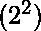
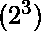
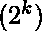
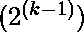

# 用一些变量计算布尔函数

> 原文:[https://www . geesforgeks . org/counting-boolean-function-with-some-variables/](https://www.geeksforgeeks.org/counting-boolean-function-with-some-variables/)

先决条件–[规范和标准形式](https://www.geeksforgeeks.org/digital-logic-canonical-standard-form/)
在下面的文章中，我们将看到一些具有三个变量的问题。

*   **Statement-1:**
    Counting the number of Boolean functions possible with two variables such that there are exactly two min terms.

    **解释:**
    正如我们已经知道的，从两个变量(a 和 b)可以形成四个数字(0，1，2，3)，即二进制数字 00，01，10，11，可能的最小项分别是 a'b '，a'b，ab '，ab 给出' 1 '作为输出，相应的二进制数字作为输入。

    因此，具有两个变量作为输入的可能函数的数量正好是两个最小项，

    其中“4”是来自两个变量的可能数，“2”是需要计算函数数的最小项数。

*   **Statement-2:**
    Counting the number of Boolean functions possible with three variables such that there are exactly three min terms.

    **解释:**
    我们已经知道，从三个变量(a、b 和 c)中，可以形成 8 个数字(0、1、2、3、4、5、6、7)，即二进制数字 000、001、010、011、100、101、110、111，可能的最小项分别是 a'b'c’、a ' b ' c、a'bc’、a'bc、a ' BC、ab'c、abc’，ABC 给出“1”

    因此，以三个变量作为输入的可能函数的数量正好是三个最小项，

    其中“8”是三个变量中可能的数，“3”是需要计算函数数的最小项的期望数。

*   **Statement-3:**
    Counting the number of boolean functions possible with three variables such that there are atmost 4 min terms.

    **说明:**
    我们已经知道，从三个变量(a、b、c)出发，可以形成 8 个数(0、1、2、3、4、5、6、7)，即二进制数字 000、001、010、011、100、101、110、111，可能的 Min 项分别为 a'b'c’、a ' b ' c、a'bc’、a'bc、a ' BC、ab'c、abc’、abc，其中 ABC 给出“1”
    因此，以三个变量作为输入的最多有 4 个最小项的可能函数的数量是，

    其中“8”是三个变量的可能数，0、1、2、3、4 是需要计算函数数的最小项数。

*   **Statement-4:**
    Counting the number of Boolean functions possible with three variables such that there are minimum 4 min terms.

    **解释:**
    我们已经知道，从三个变量(a、b 和 c)中，可以形成 8 个数字(0、1、2、3、4、5、6、7)，即二进制数字 000、001、010、011、100、101、110、111，可能的最小项分别是 a'b'c’、a ' b ' c、a'bc’、a'bc、a ' BC、ab'c、abc’，ABC 给出“1”
    因此，具有三个变量作为输入的可能函数的数目使得最少有 4 个最小项，

    其中“8”是三个变量中可能的数，4、5、6、7 是需要计算函数数的最小项的期望数。

*   **Statement-5:**
    Counting the number of Boolean functions possible with ‘k’ variables such that there are ‘m’ min terms.

    **解释:**
    我们已经知道，从‘k’个变量中，个数字可以组成。
    因此，以‘k’个变量作为输入从而存在‘m’个最小项的可能函数的数量是，

    其中是来自‘k’个变量的可能数量，而‘m’是需要计算函数数量的最小项的期望数量。

*   **Statement-6:**
    Counting the number of Boolean functions possible in neutral function of ‘3’ variables where there is equal number of min and max terms.

    **说明:**
    我们已经知道，从三个变量(a、b 和 c)中，可以形成 8 个数字(0、1、2、3、4、5、6、7)，即二进制数字 000、001、010、011、100、101、110、111，并且存在相等数量的最大和最小项，这给出了作为最小项输出的“1”和作为输入的相应二进制数字的最大项输出的“0”。

    例如，假设 000 是二进制数字，那么最小项将是 a'b'c '，最大项将是 abc。
    因此，在中性函数中具有三个变量的可能布尔函数的数量是，

    其中“8”是三个变量中可能的数字，4 是需要计算函数数量的最小项或最大项的期望数量。

*   **Statement-7:**
    Counting the number of Boolean functions possible in neutral function of ‘k’ variables where there is an equal number of min and max terms.

    **解释:**
    我们已经知道，从‘k’个变量中，个数字可以组成。
    因此，以‘k’变量作为输入的可能布尔函数的数量，其中最小和最大项的数量相等，

    其中是来自‘k’变量的可能数量，是需要计算函数数量的最小或最大项的期望数量。