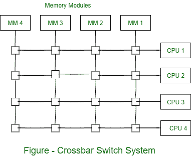
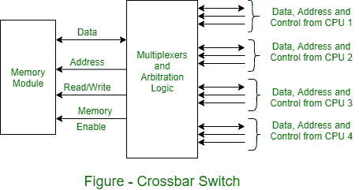

# 纵横制交换机

> 原文:[https://www.geeksforgeeks.org/crossbar-switch/](https://www.geeksforgeeks.org/crossbar-switch/)

**交叉开关**系统包含多个交叉点，这些交叉点位于存储器模块和处理器总线路径的交叉点。在每个交叉点上，小方块代表一个开关，它获得从处理器到内存模块的路径。每个开关点都有控制逻辑来建立存储器和处理器之间的传输路径。它计算放置在总线中的地址，以获得其特定模块是否被寻址。此外，它消除了在预定优先级基础上对同一存储器模块的多个访问请求。

**连接到一个内存模块的纵横制交换机的功能设计**如图所示。该电路包含多路复用器，从一个中央处理器选择数据、地址和控制，用于与存储模块通信。当两个或多个中央处理器试图访问同一内存时，仲裁逻辑建立优先级来选择一个中央处理器。多路复用器可以由仲裁逻辑内的优先级编码器产生的二进制代码来处理。

纵横制交换系统允许来自所有存储器模块的同时传输，因为每个模块都有单独的路径。因此，实现交换机所需的硬件可能会变得相当大和复杂。