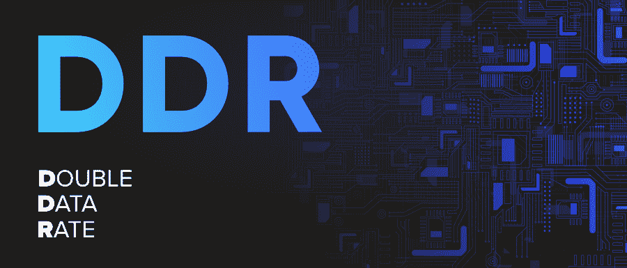
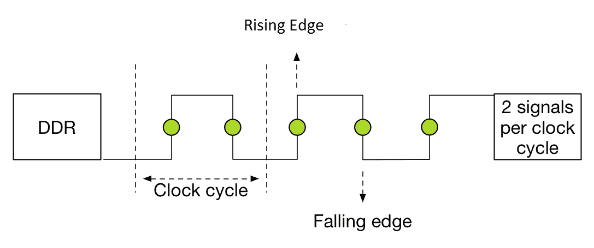

# 解除武装、复员和重返社会完整表格

> 原文:[https://www.geeksforgeeks.org/ddr-full-form/](https://www.geeksforgeeks.org/ddr-full-form/)

**DDR** 代表**双倍数据速率**。这是一种计算技术，计算机总线在时钟周期的上升沿和下降沿以两倍的速率传输数据。这种方法允许每个时钟周期发送 2 个信号。

设计电子电路最简单的方法是让它在每个时钟周期执行一次传输(软件无线电技术就是利用这一点)。这要求时钟信号每周期改变两次。在高带宽下工作时，信号完整性限制会限制时钟频率。通过使用时钟的两个边沿，数据信号以相同的限制频率工作，但传输的数据总量增加了一倍。这是特别提款权的改进版本，使用特别提款权技术进行数据传输。

这项技术是对其前身 SDR(单数据速率)的改进，并由一个名为 QDR(四数据速率)的改进版本所继承。双数据速率时钟周期如下

#### 复员方案的特点:

*   每个周期传输两次数据(波/时钟)，首先在时钟周期的上升沿，然后在下降沿
*   每个时钟周期都有单向数据流
*   DDR SDRAM 技术比旧的 SDRAM 模块功耗更低，旧的 SDRAM 模块比 DDR SDRAM 的 2.6 伏扩展了 3.3 伏。
*   DDR 的工作频率与时钟周期相同。

#### 复员方案的优势:

*   获得更高水平的传输速度
*   减少执行任务所需的周期数
*   降低所需的组件成本
*   支持更小尺寸的计算设备

#### 复员方案的缺点:

*   与 QDR(四倍数据速率)技术相比，速度较慢
*   采用 DDR 技术的设备产生更多热量

#### 复员方案的应用:

这种技术在要求高数据传输速度的应用中已被广泛接受，例如:

*   该技术被广泛用于为计算机构建易失性组件，通常被称为 DDR SDRAM(双数据速率同步动态随机存取存储器)。该技术在该领域取得了很大成功，因此在该技术的后续迭代中以 DDR2 SDRAM、DDR3 SDRAM、DDR4 SDRAM 的名称实现了相同的技术。
*   该技术用于在图形处理器(图形卡)中集成易失性存储功能，被称为 GDDR(图形双倍数据速率)。这是一项为显卡量身定制的技术
*   用于模数转换器
*   用于某些微处理器(AMD 的 Athlon64 系列)的总线，允许数据以更快的速度传输到中央处理器。