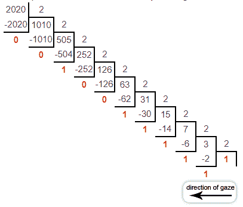
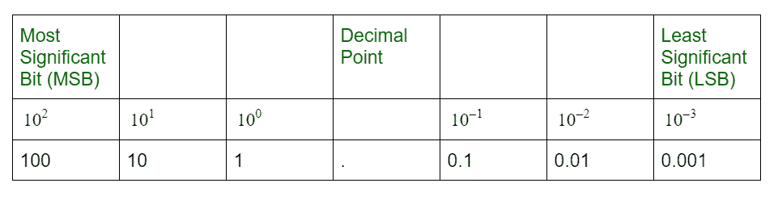
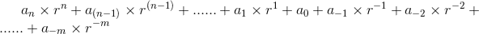

# 十进制数字系统

> 原文:[https://www.geeksforgeeks.org/decimal-number-system/](https://www.geeksforgeeks.org/decimal-number-system/)

一个[数字系统](https://www.geeksforgeeks.org/classification-of-number-system/)可以被认为是使用一组数字或符号的数字的数学符号。简单地说，数字系统是一种表示数字的方法。每个数字系统都是借助于它的基数来识别的。例如，二进制、八进制、十进制和十六进制数字系统用于微处理器编程。

**十进制数字系统:**
如果数字系统的基值是 10。这也被称为十进制数字系统，它有 10 个符号，它们是:0，1，2，3，4，5，6，7，8，9。每个数字的位置都有一个 10 的幂的权重。
则称之为十进制数制，在科技发展中具有最重要的作用。这是加权(或位置)数字表示，其中每个数字的值由它在数字中的位置(或它们的权重)决定。

十进制系统中的每个位置都比前一个位置高 10 倍，这意味着十进制数的数值是通过将该数的每个数字乘以该数字出现的位置的值，然后将乘积相加而确定的。

**例-1:** 数字 2020 解释为:-

```
= (2020)10
= (1024 + 512 + 256 + 128 + 64 + 32 + 4)10
= (210x1+29x1+28x1+27x1+26x1+25x1+24x0+23x0+22x1+21x0+20x0)10
= (11111100100)2 
```



因此，

```
= (2020)10 = (11111100100)2 
```

**例-2:** 数字 2020.50 解释为:-

```
= (2020.50)10
= (1024 + 512 + 256 + 128 + 64 + 32 + 4 + (1/2))10
= (210x1+29x1+28x1+27x1+26x1+25x1+24x0+23x0+22x1+21x0+20x0+2-1x1)10
= (11111100100.1)2 
```

因此，

```
= (2020.50)10 = (11111100100.1)2 
```

**注:**
最右位是最低有效位(LSB)，最左位是最高有效位(MSB)。



一般来说，用基数-r 系统表示的数具有乘以 r 的幂的系数。系数 aj 的范围从 0 到(r-1)。用基数-r 表示实数如下:



其中，a <sub>0</sub> 、a <sub>1</sub> 、… a <sub>(n-1)</sub> 和 a 为整数部分位数，n 为整数位数的总数。
a <sub>-1</sub> 、a <sub>-2</sub> 、…和 a <sub>-m</sub> 为小数部分位数，m 为小数位数的总数。

**十进制的优缺点:**

*   **优点–**可读性强，人类使用，易于操作。
*   **缺点–**浪费空间和时间。

**十进制(基数-10)数的 9 和 10 补码:**

*   简单地说，十进制数的 [9 的补码](https://www.geeksforgeeks.org/9s-complement-decimal-number/)是它的每一位数字从 9 中减去。例如，十进制数 2005 的 9 的补码是 9999–2005 = 7994。
*   [十进制数的 10 补码](https://www.geeksforgeeks.org/10s-compliment-of-a-decimal-number/)是给定数加 1 到最低有效位(LSB)的 9 补码。例如，十进制数 2005 的 10 的补码是(9999–2005)+1 = 7995。