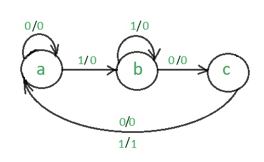
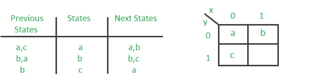
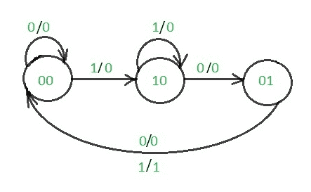
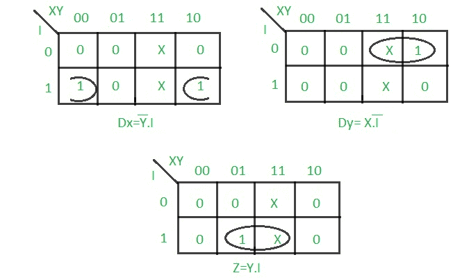

# 设计 101 序列检测器(Mealy 机器)

> 原文:[https://www . geesforgeks . org/design-101-sequence-detector-mealy-machine/](https://www.geeksforgeeks.org/design-101-sequence-detector-mealy-machine/)

先决条件–[米莱和摩尔机器](https://www.geeksforgeeks.org/mealy-and-moore-machines/)
一个**序列检测器**是一个顺序状态机，它获取一个输入位串，并在检测到目标序列时产生一个输出 1。在 Mealy 机器中，输出取决于当前状态和外部输入(x)。因此，在图中，输出与输入一起写入状态之外。序列检测器有两种类型:

1.  重合
2.  不重叠

在重叠序列检测器中，一个序列的最后一位成为下一个序列的第一位。然而，在非重叠序列检测器中，一个序列的最后一位不会成为下一个序列的第一位。在这篇文章中，我们将讨论非重叠 101 Mealy 序列检测器的设计过程。

**示例:**

```
For non overlapping case
Input :0110101011001
Output:0000100010000

For overlapping case
Input :0110101011001
Output:0000101010000
```

设计非重叠 101 Mealy 序列检测器的步骤是:

**步骤 1:绘制状态图–**
101 序列检测器的 Mealy 机器的状态图为:



**第 2 步:代码分配–**

**规则 1** :对于给定的输入条件，具有相同的下一个状态的状态应该具有相邻的赋值。
**规则 2** :作为单一州的下一个州必须被分配相邻的任务。
规则 1 优先于规则 2。



代码分配后的状态图是:



**步骤 3:制作当前状态/下一状态表–**
我们将使用 D 触发器进行设计。


**第四步:绘制 Dx、Dy 和输出(Z)的 K 图–**



**第五步:最后实现电路–**


这是 Mealy 101 非重叠序列检测器的最后一个电路。