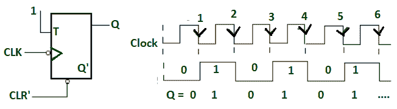
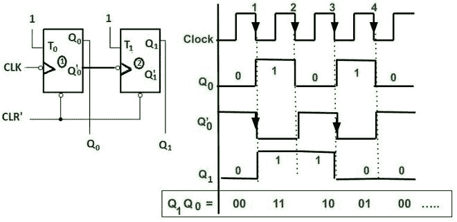
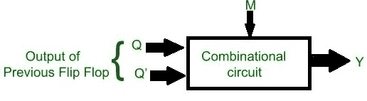
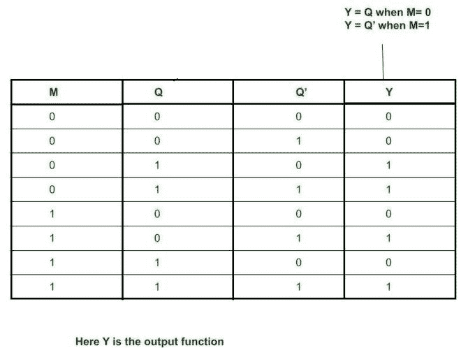
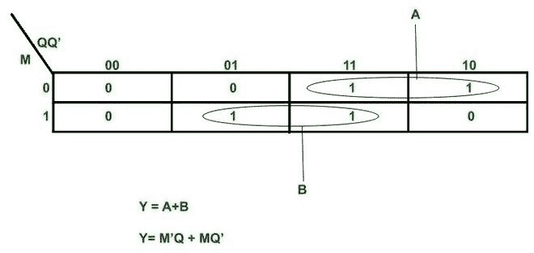
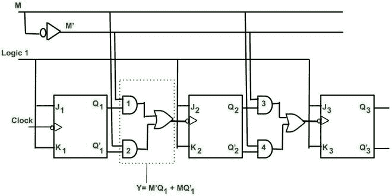
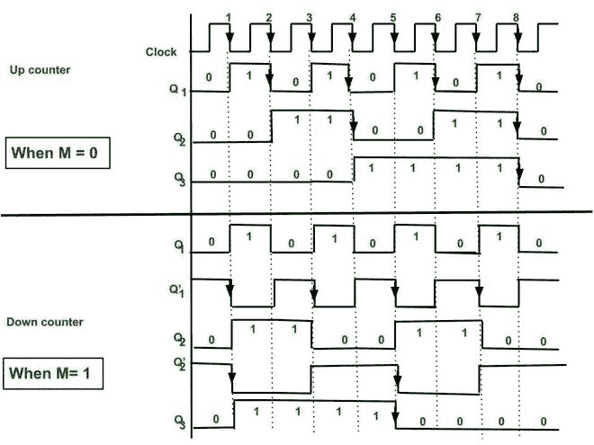

# 设计异步升/降计数器

> 原文:[https://www . geesforgeks . org/design-异步-向上-向下-计数器/](https://www.geeksforgeeks.org/design-asynchronous-up-down-counter/)

**先决条件** : [波纹计数器](https://www.geeksforgeeks.org/ripple-counter-in-digital-logic/)。

在异步/纹波计数器中，第一触发器的输出作为时钟提供给第二触发器**，即**触发器(FF)不同时计时。
电路比较简单，但是速度慢。

**异步计数器基础:**

**1 位异步/纹波计数器**

当施加-ve 边沿时钟脉冲，并且输入给 FF 逻辑 1 时，FF 的输出状态将在每个下降沿切换。输出频率为 f/2(如果 f 是时钟频率)。它被称为二进制或 mod -2 计数器或位波纹计数器。
有 2 个唯一的输出状态(0 和 1)。

**2 位异步上行计数器。**

当两个 FF 串联时，一个 FF 的输出作为第二个 FF 的时钟。因此，只有当输出和第一 FF 为逻辑 1 且出现下降沿时，第二 FF 的状态才会改变。Q 1 的输出频率为 f/4(如果 f 为时钟频率)。
它可以产生 4 种不同的独特状态。这就是所谓的 4 分频电路或 mod 4 纹波计数器。
此处输出取 Q 1 (MSB) Q 0 (LSB)。

由此，我们可以得出结论–

如果有 n 个 FFs，那么输出频率将除以 2 n 。也产生 2n 个唯一的状态。

所以分频基本形成计数状态。
这里我们看到第一 FF 的输出充当第二 FF 的时钟。假设 FF 需要 30ns 来产生输出(即，由于门而导致的传播延迟)。因此，60 ns 后将获得第二个 FF 的输出。因此，传播延迟是通过 FFs 的波纹，并且随着 FFs 数量的增加而变得更大。
因此，异步计数器对于产生大计数来说太慢了。

*   正如我们所知，当前一个 FF 的输出状态(即 **Q** )作为时钟馈送到下一个 FF 时，计数器将执行向上计数，如上所述(即 0 1 2 3)。
    在第 4-5 个边沿时钟脉冲后，序列将重复。
*   当前一个 FF 的补码输出状态(即**Q’**)作为时钟提供给下一个 FF 时，计数器将执行向下计数，如下图所示(即 3 2 1 0)。
    在第 4-5 个边沿时钟脉冲后，序列将重复。

**2 位异步递减计数器**

现在我们正在设计升/降计数器。
向上/向下计数器是两个计数器的组合，我们可以通过改变模式控制输入来执行向上或向下计数。

**3 位异步升/降计数器的设计** :
比单独的升/降计数器用的多。

1.  在这种情况下，模式控制输入(比如 M)用于选择向上和向下模式。
2.  每对触发器之间需要一个组合电路来决定是向上计数还是向下计数。

对于 n = 3，即 3 位计数器–
最大计数= **2 n -1** ，状态数为 **2 n 。**

设计涉及的步骤有:
**步骤 1** : **模式控制输入决策–**

**模式控制输入的决定**

当 M = 0，那么 Y= Q，因此它将执行向上计数(如上所述)。
当 M = 1，那么 Y = Q’，因此它将执行向下计数(如上所述)。
需要组合电路来决定模式控制(即计数器是向上计数还是向下计数)。
所以所有可能的组合是–

寻找输出 Y 的 k 图，该输出 Y 将作为下一个 FF 的时钟。

**寻找 Y 的 K 图**

**步骤 2** : **在每对 FFs 之间插入组合逻辑–**

**上升/下降计数器**

**时序图:**
初始 Q 3 = 0，Q 2 = 0，Q 1 = 0。

**3 位异步升/降计数器时序图**

**情况 1–**当 M=0 时，则 M’= 1。
把这个放在 Y **= M'Q + MQ'= Q** 所以 Q 是作为下一个 FFs 的时钟。
因此，计数器将作为上行计数器。

**上行计数器解释–**

*   第一个 FF 连接到逻辑 1。因此，它将在每个下降沿切换。
*   第二个 FF 输入连接到 Q 1 。因此，当 Q 1 = 1 并且存在时钟下降沿时，它改变其状态。
*   同样，第三个 FF 连接到 Q 2 。因此，当 Q 2 = 1 并且存在时钟下降沿时，它改变其状态。
*   由此我们可以产生上行计数器的计数状态。
*   在每第 8 个下降沿之后，计数器再次达到状态 0 0 0。
    因此也称为 8 分频电路或 mod 8 计数器。

**情况 2–**当 M=1 时，则 M’= 0。
放入 **Y= M'Q + MQ'= Q'** 。所以 Q '是作为下一个 FFs 的时钟。
因此，计数器将作为向下计数器。

**倒计时说明–**

*   第一个 FF 连接到逻辑 1。因此，它将在每个下降沿切换。
*   第二个 FF 输入连接到 Q' 1 。因此，当 Q' 1 = 1 并且存在时钟下降沿时，它改变其状态。
*   同样，第三个 FF 连接到 Q' 2 。因此，当 Q' 2 = 1 并且存在时钟下降沿时，它改变其状态。
*   这样我们就可以产生递减计数器的计数状态。
*   在每第 8 个下降沿之后，计数器再次达到状态 0 0 0。
    因此也称为 8 分频电路或 mod 8 计数器。