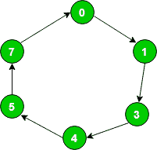
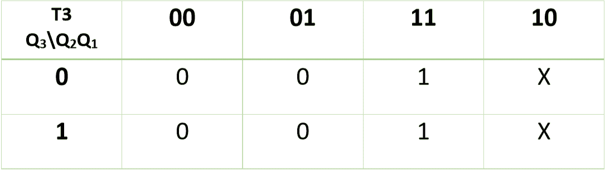
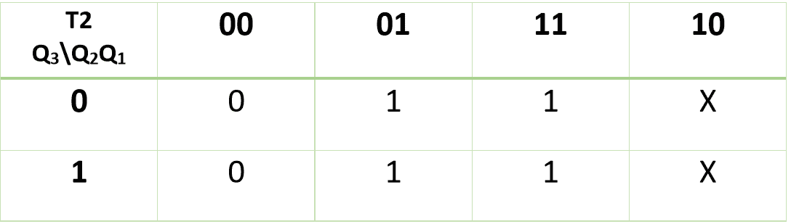
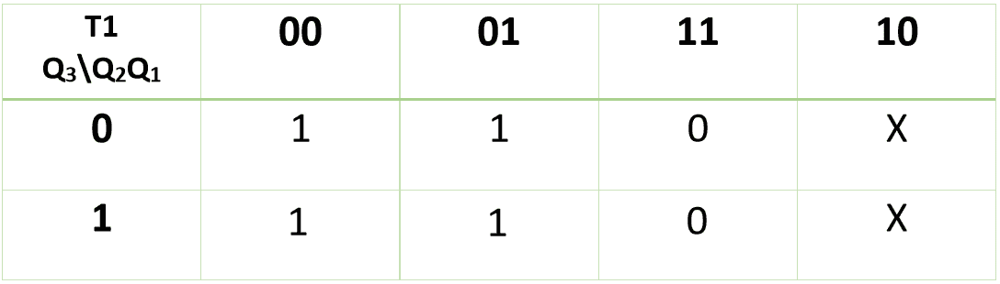
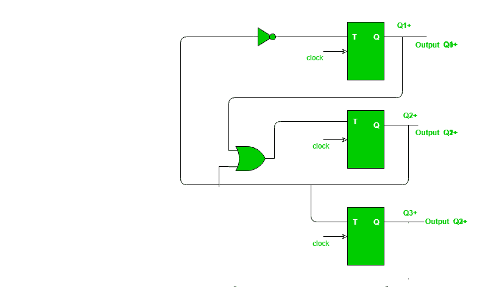

# 给定序列的设计计数器

> 原文:[https://www . geesforgeks . org/design-counter-给定-sequence/](https://www.geeksforgeeks.org/design-counter-given-sequence/)

先决条件–[计数器](https://www.geeksforgeeks.org/counters-in-digital-logic/)
**问题–**使用 T 触发器为序列设计同步计数器:0 → 1 → 3 → 4 → 5 → 7 → 0。

**解释–**对于给定的序列，状态转换图如下:



状态转换表逻辑:

| 现状 | 次状态 |
| --- | --- |
| Zero | one |
| one | three |
| three | four |
| four | five |
| five | seven |
| seven | Zero |

给定序列的状态转换表:

| 现状 | 次状态 |
| --- | --- |
| Q <sub>3</sub> | Q <sub>2</sub> | Q <sub>1</sub> | Q <sub>3</sub> (t+1) | Q <sub>2</sub> (t+1) | Q <sub>1</sub> (t+1) |
| Zero | Zero | Zero | Zero | Zero | one |
| Zero | Zero | one | Zero | one | one |
| Zero | one | one | one | Zero | Zero |
| one | Zero | Zero | one | Zero | one |
| one | Zero | one | one | one | one |
| one | one | one | Zero | Zero | Zero |

**T 触发器–**如果 Q 值从 0 变为 1 或从 1 变为 0，则 T 触发器的输入为 1，否则输入值为 0。

| Q <small>t</small> | Q <small>t+1</small> | **T** |
| --- | --- | --- |
| Zero | Zero | Zero |
| Zero | one | one |
| one | Zero | one |
| one | one | Zero |

利用 T 触发器的激励表绘制所有 T 触发器的输入表。因为 T 触发器的本质是触发器。这里，Q3 为最高有效位，Q1 为最低有效位。

| 触发器输入表 |
| --- |
| T <sub>3</sub> | T <sub>2</sub> | T <sub>1</sub> |
| Zero | Zero | one |
| Zero | one | Zero |
| one | one | one |
| Zero | Zero | one |
| Zero | one | Zero |
| one | one | one |

用 K-Map(卡诺图)求 Q <sub>3</sub> 、Q <sub>2</sub> 、Q <sub>1</sub> 中 T <sub>3</sub> 、T <sub>2</sub> 、T <sub>1</sub> 的值:



因此，

```
T3 = Q2 
```



因此，

```
T2 = Q1 
```



因此，

```
T1 = Q2’ 
```

现在，您可以使用 K 图的表达式来设计所需的电路:

