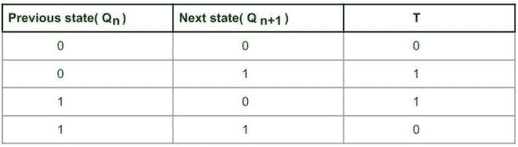
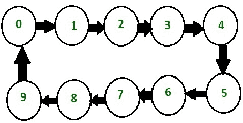
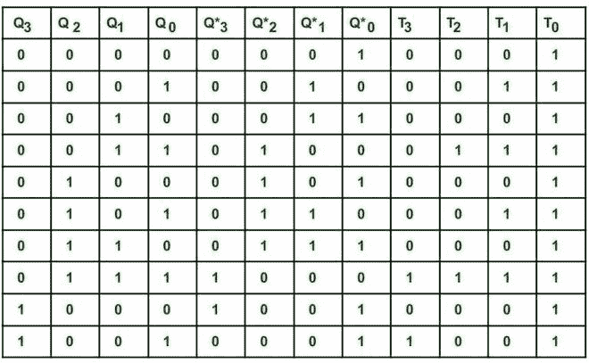
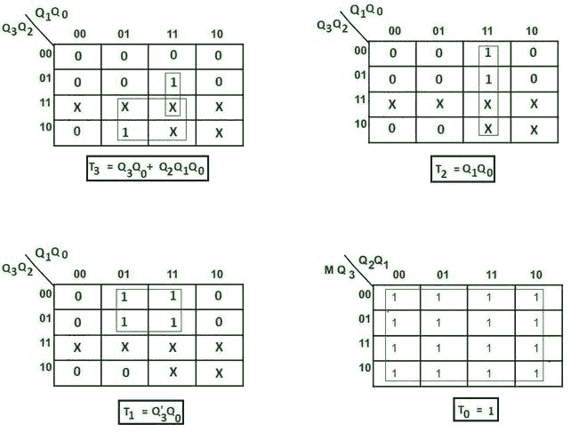
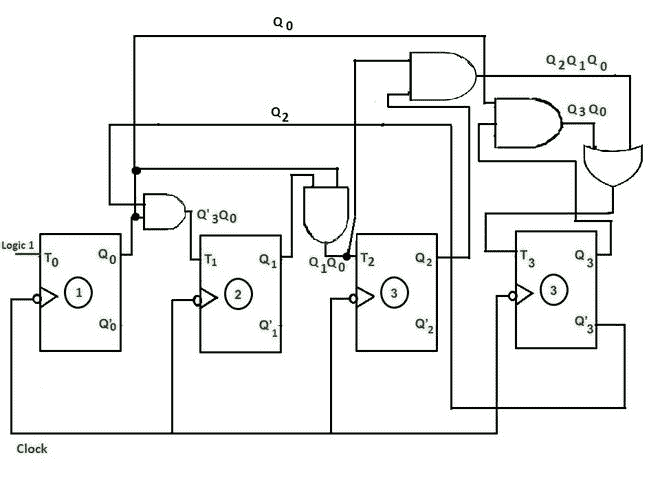
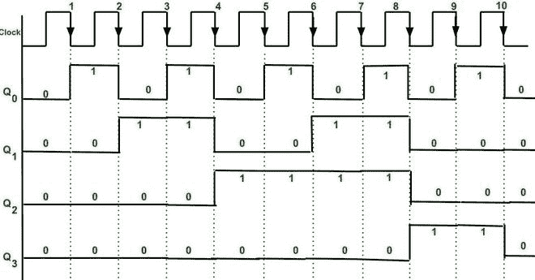

# 设计模式–N 同步计数器

> 原文:[https://www . geesforgeks . org/design-mod-n-synchronized-counter/](https://www.geeksforgeeks.org/design-mod-n-synchronous-counter/)

**简介:**
N 的值可以和 2 的幂不同。此外，计数序列可以是随机的，例如一些循环码(8421、2423 等)。以下方法用于设计模 N 和任何计数序列。

**Mod-N 计数器的设计** :
设计步骤为–

**第一步:** **决定触发器的数量–**
**例**:如果我们设计的是 mod N 计数器，并且需要 N 个触发器，那么可以通过这个等式求出 N。

```
 N  <= 2<sup>n</sup>
```

这里我们设计的是 Mod-10 计数器因此，N= 10，需要的触发器数量(N)为
**对于 n =3，** 10 < =8，为假。
**对于 n= 4，** 10 < =16，这是真的。

```
Therefore number of FF required is 4 for Mod-10 counter.
```

**第二步:写触发器的激励表–**
这里用的是 T FF



**T FF 的励磁表。**

**第三步:绘制状态图和电路励磁表–**



**十进制计数器的计数顺序**

十进制计数器被称为 mod -10 或除以 10 计数器。它从 0 到 9 计数，然后再次重置为 0。它在自然二进制序列中计数。这里使用 4 T 触发器。在 Q<sub>3</sub>Q<sub>2</sub>Q<sub>1</sub>Q<sub>0</sub>= 1001 后复位。

**电路激励表–**
这里 Q<sub>3</sub>Q<sub>2</sub>Q<sub>1</sub>Q<sub>0</sub>是四个触发器的存在状态，Q *<sub>3</sub>Q *<sub>2</sub>Q *<sub>1</sub>Q *<sub>0</sub>是四个触发器的下一个计数状态。如果当前状态存在转换，即如果 Q3 值从 0 变为 1 或从 1 变为 0，则相应的 T(触发)位被写入 1，否则为 0。



**电路励磁表。**

**步骤 4:根据触发器输出为每个 FF 输入创建卡诺图作为输入变量–**
简化 K 图–



**求极小表达式的 K 图。**

**第五步:创建电路图–**
此处负沿触发时钟用于切换目的。

*   时钟在同一时刻提供给每个触发器。
*   根据简化的 K 映射方程，触发(T)输入被提供给每个触发器。



**电路图**

**时序图:**这里使用切换。


**T FF 特征表。**

**只有当 FF 的触发输入(T)为 1 时，FF 的状态才会改变。**



**同步十进制计数器时序图**

**说明:**

*   最初 Q3 Q2 Q1 Q0 为 0 0 0 0 **。**
*   从时序图可以验证计数器的顺序。在时钟输出的每个下降沿，Q <sub>0</sub> 切换，因为 T <sub>0</sub> 连接到逻辑 1 **。**
*   T <sub>1</sub> 变为 1 只有当表达式 T1 = Q' <sub>3</sub> Q <sub>0</sub> 也变为 1 时，如果时钟下降沿出现(因为有负沿触发)，那么 T <sub>1</sub> 的输出状态，即 Q <sub>1</sub> 将改变。
*   T <sub>2</sub> 仅当表达式 T2 = Q <sub>1</sub> Q <sub>0</sub> 也变为 1 时才变为 1。如果时钟下降沿出现，则输出状态 Q2 将改变。
*   T <sub>3</sub> 只有当表达式 T1 = Q<sub>3</sub>Q<sub>0</sub>+Q<sub>2</sub>Q<sub>1</sub>Q<sub>0</sub>结果也变为 1 如果时钟下降沿发生(因为有负沿触发)，那么 Q3 的状态将改变。
*   我们得到的输出为 Q<sub>3</sub>(MSB)Q<sub>2</sub>Q<sub>1</sub>Q<sub>0</sub>(LSB)。
*   第 10 个下降沿后，所有 FFs 的输出状态再次变为 0 0 0 0。