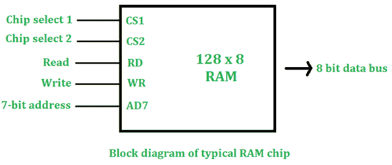
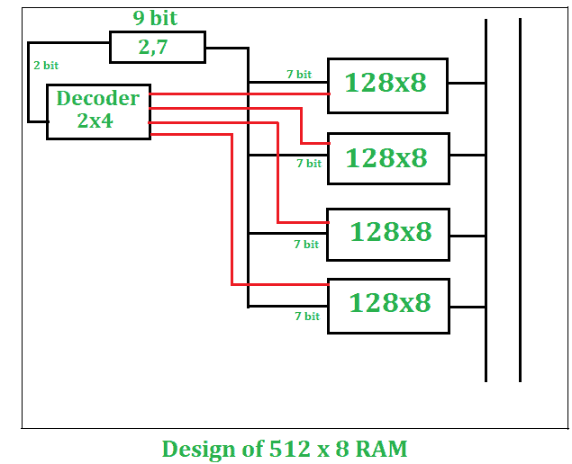

# 采用 128×8 内存的 512×8 内存设计

> 原文:[https://www . geesforgeks . org/design-of-512 x8-ram-using-128 x8-ram/](https://www.geeksforgeeks.org/design-of-512x8-ram-using-128x8-ram/)

如果我们在物理上看到内存，那么我们会注意到内存是由一些芯片组成的。我们可以使用基本的内存芯片来设计所需的内存大小。

**我们可以观察到一个基本的 RAM 芯片如下:–**



1.  **CS1:–**
    对于芯片选择 1，该值应为 1
2.  **CS2:–**
    对于芯片选择 2，该值应为 0。
3.  **读写:–**
    用表示即将到来的信号。

如果我们有 n 位地址和 m 位字，那么我们的内存大小将是**2<sup>n</sup>x m**

**示例:**

```
n=7 bit, m=8 bit
RAM size= 128 x 8 
```

**给定:–**

```
Basic RAM size = 128 x 8
Required RAM size  = 512 x 8
```

**要从 128×8 设计一个 512×8 的 RAM 大小，这里有一些我们需要先做的计算–**

**1。所需芯片数量:**

```
Number of chips required  = Desired RAM Size/ Basic RAM Size
                                          =512x8/128x8
                                          =4 chips
```

**2。地址位:**

```
Required Size is 512 x 8  
512 x 8= 29 x 8
Therefore, 9 bit address is required
```

**3。解码器大小:**
如果字数增加，就需要一个解码器。
在这种情况下，字数在增加(从 128 个增加到 512 个)。

```
Size of decoder= number of times words increasing
128⇢512
words increased by 4 times
Decoder Size= 2x4
```

**图片说明(512×8 RAM 设计):**

从上面的计算，我们看到我们需要四个**128×8**的 RAM 芯片来设计一个**512×8**的 RAM 大小。如果只有字数在增加，那么所有的芯片将垂直排列。在这种情况下，只有字数在增加(128-512)，因此所有芯片都将垂直排列。

1.  在**512×8**RAM 中，有一个 9 位地址，我们将这个 9 位地址分为 2 位和 7 位地址。
2.  2 位地址将作为**2×4**解码器输入，该解码器将有 4 个输出，输入将有 2 位。
3.  解码器的 4 路输出将单独启用**128×8**的每个内存。
4.  另外，我们可以把 128×8 的 RAM 芯片写成**2<sup>7</sup>×8、**每个 RAM 芯片都需要一个 7 位地址。我们将把剩下的 7 位地址线连接到每个内存。
5.  这个 7 位地址将从该随机存取存储器的 128 个字中选择任何一个字，选择的字将作为输出总线中的 8 位字输出。

