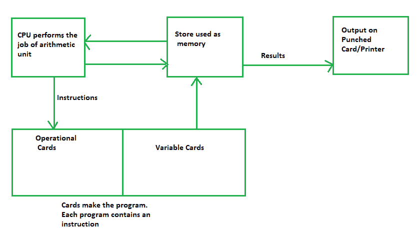

# 分析引擎的设计

> 原文:[https://www.geeksforgeeks.org/design-of-analytical-engine/](https://www.geeksforgeeks.org/design-of-analytical-engine/)

**分析引擎** 一般认为是 1837 年查尔斯·巴贝奇设计的第一台机械计算机。这是T4 最成功的成就之一。他的分析引擎有四个不同的部件或零件。这些组件是阅读器、商店、工厂和打印机。分析引擎使用带内存、穿孔卡和基本流量控制的算术逻辑单元。查尔斯·巴贝奇在机器编程语言中使用各种循环和条件。

分析引擎是差异引擎的继承者。他使用了各种系列的穿孔卡片作为设计输入，用于算术运算、数字常数和存储操作。

解析引擎包括 CPU 和 ALU，两者都是物理鼓和旋转鼓的组合，只是因为它满足了不同图灵机的要求和需求。差异引擎的后继者被称为分析引擎。查尔斯·巴贝奇写了几千页，还和他们一起起草了 250 幅画。

所有这些单元的工作方式更像是一台现代计算机，而且今天这一代使用的所有现代计算机都是基于它。这些是:输入，输出，内存，中央处理器

***查尔斯·巴贝奇分析引擎的逻辑结构***

这些解释如下。

1.  **输入–**
    查尔斯·巴贝奇分析引擎正在处理穿孔卡执行的数据和程序。这些穿孔卡片被称为阅读器。

2.  **输出–**
    t 用于对给定公式的三角函数数值进行各种计算。查尔斯·巴贝奇一直使用穿孔卡片和模拟打印机进行输入和输出。输入和输出是用穿孔卡片完成的。

3.  **CPU(中央处理器)–**
    用于执行所有算术运算和比较。它有助于将各种数字存储到寄存器中，操作由微程序控制。它还使用这些控制机制来自动执行操作。它用于将面向用户的指令翻译成各种内部硬件。

4.  **记忆(MI)–**
    在分析引擎中，查尔斯·巴贝奇将 MI 或 Memory 称为商店。这是一家有 40 位十进制千位数的商店。存储器是存储数据进行处理的地方。