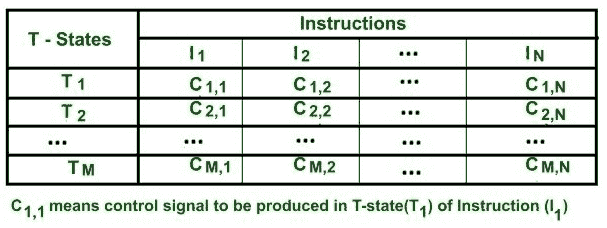
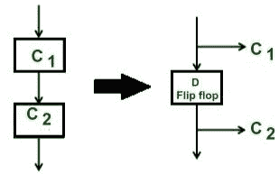
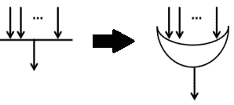
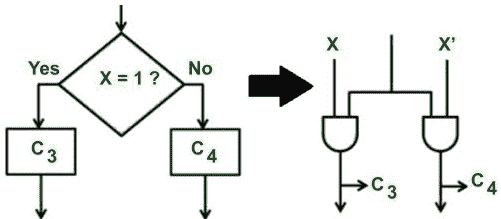
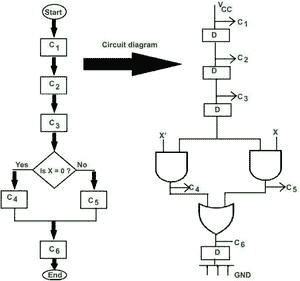
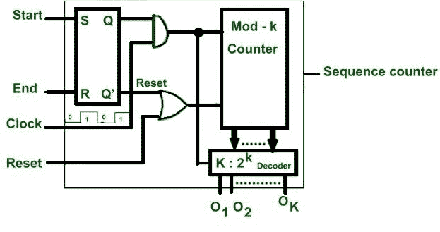
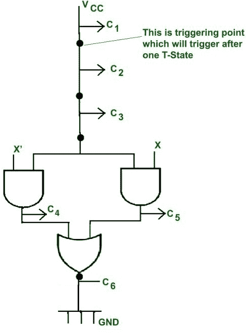
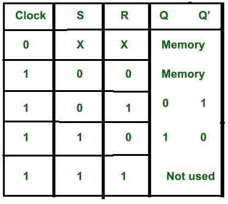

# 硬连线控制单元的设计方法

> 原文:[https://www . geeksforgeeks . org/design-methods-of-fixed-control-unit/](https://www.geeksforgeeks.org/designing-methods-of-hardwired-control-unit/)

**先决条件:** 

这里，控制信号是使用硬件生成的。
有三种类型的硬连线控制单元。
**1** 。**状态表法:**

**状态表法**

*   这里，控制单元的行为以表格的形式表示，该表格被称为**状态表**。
*   这里，每行代表 T 状态，列代表指令。
*   特定列与每一行的每一个交叉点都指示哪个控制信号将在指令的相应 T 状态中产生。
*   这里，硬件电路是为每一列(即，为特定指令)设计的，用于产生不同 T 状态的控制信号。

**优势–**

*   这是最简单的方法。
*   这种方法主要用于小型指令集处理器(即在 RISC 处理器中)。

**缺点–**

*   在现代处理器中，有大量的指令集。因此，电路变得设计复杂，调试困难，如果我们对状态表进行任何修改，那么电路的大部分需要改变。
*   因此，这并没有广泛用于这类处理器。
*   在电路设计中有许多冗余，例如获取指令需要控制信号，这是常见的，并且要重复 N 个指令。因此，电路设计的成本可能会增加。

**2。延迟元素法:**

*   这里，控制单元行为以**流程图**的形式表示。
*   流程图中的每个步骤都代表了处理指令所需产生的控制信号。
*   如果指令的所有步骤都被执行，这意味着指令被完全执行。
*   **控制信号执行微操作，每个微操作需要一个 T 状态。**
*   对于独立的微操作，需要在不同的 T 状态下进行。因此，对于每个连续的控制信号，都需要精确的 1 态延迟，这可以在 D FF 的帮助下产生。
*   因此。每两个连续的控制信号之间插入一个 d 触发器。

*   我们可以观察到，在每对控制信号之间引入了 D FF。因此，在产生控制信号之后，在该控制信号之前的延迟元件直到下一个指令需要该控制信号之前才被使用。因此，在所有 D 触发器中，一次只有一个处于活动状态。所以这个方法也被称为**一热法**。
*   在流程图中，如果控制信号有多个入口点，那么为了组合两条或多条路径，我们使用或门。

*   决策框被转换成一组两个互补的与门。

**示例–**
假设处理器有两条加法或减法指令(因此需要 1 位操作码，其中 0 操作码用于加法指令，1 操作码用于减法)。

**产生控制信号的延迟元件法。**

**流程图设计–**
说C 1 ，C 2 ，C 3 是取指令的控制信号。当 X= 0 时，则产生 C 4 控制信号(即解码)用于执行加法运算，当 x=1 时，则产生 C 5 控制信号用于执行减法运算。c 6 控制信号存储结果，过程结束。

**电路设计**–
在两个独立的连续控制信号之间，引入一个延迟元件，产生 1 T 状态的延迟。决策框被转换成并补充与门电路(即，如果 x= 0，则 x’= 1，因此，产生 c 4 控制信号。

**优势–**

*   该方法具有逻辑性，因此有助于降低电路复杂度。
*   对于需要在每个指令中产生的公共控制信号，只能为它们设计一个电路。

**缺点–**

*   随着指令数量的增加，用于产生延迟的 D FF 数量增加，因此整体电路复杂度和成本增加。

**3。顺序计数法:**

**序列计数器法**

*   这是在每个连续控制信号之间产生延迟的最流行和最常用的方法。
    主要优点是采用流程图的逻辑方式，没有使用不必要的 D FF 数。
*   首先，设计流程图来表示控制单元的行为。
*   然后，使用与门和或门的相同方法将其转换为电路(如上面的延迟元件方法所示)。

延迟元件方法中使用的两条指令的示例

**延迟元素方法中使用的 2 条指令示例** [/caption]

*   它类似于延迟元件方法，但唯一的区别是，电路中没有不必要的 D 触发器，而是有触发点。它们在一对一的 T 状态间隔后被激活。

**顺序计数器电路的工作–**

*   这里使用一个 SR FF、一个解码器和一个计数器。

**SR FF 真值表**

*   当指令周期开始时，则 start = 1 **。**
*   我们知道，当开始= 1 时，因为 S 连接到开始，所以 Q 变成 1，Q’变成 0。
*   这里使用**电平触发时钟**。因此，当时钟= 1 或高电平且 Start=1 时，由于两个输出都连接到与门，因此如果两者的结果都为 1，则启用计数器，计数器从 0 0 0 状态开始计数。因此，0 0 0 状态由解码器解码并产生输出 01，这将触发控制电路中的触发点。
*   **随着时钟在 1 个 T 状态**后再次变高。因此，当时钟= 0 时，计数器状态保持不变(Q 和 Q’)直到时钟再次变为高电平。这确保了计数器在一对一的 T 状态间隙后改变其状态。
*   **假设计数器是 3 位，它产生 2 3 = 8 个状态(000 001 …..111)** 。第一个计数 0 0 0 被提供给 3:8 解码器。它将激活输出 1 号。该输出不是控制信号，但会触发控制单元电路中的触发点。
*   由于时钟在一个 T 状态的间隙后再次变为高电平，因此时钟=1 且开始= 1，然后计数器被使能并将其状态变为 001，计数器解码计数并使 O 2 输出为高电平。这将触发电路中的第二个触发点。
*   所有计数状态都以相同的方式解码。

如果计数器是 K 位的，那么需要 K:2 K 解码器，这可以产生 2K 输出，并且在电路中 1-1 T 状态的间隙之后将触发 2K 触发点。

*   当指令结束时，产生控制信号使 End 引脚= 1，计数器复位，所以下一次，它从第一个计数(0 0 0)开始。
*   如果 reset 引脚=1，则计数器将复位，此后将再次从 000 状态开始计数。

**优势**:

*   使用较少数量的触发器。

**硬连线控制单元的缺点:**

*   在现代处理器中，有大量的指令集。因此，电路变得设计复杂，调试困难，如果我们做任何修改，那么很大一部分电路需要改变。因此，它适用于 RISC 处理器。