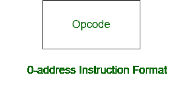

# 3 地址指令和 0 地址指令的区别

> 原文:[https://www . geesforgeks . org/3 地址指令和 0 地址指令的区别/](https://www.geeksforgeeks.org/difference-between-3-address-instruction-and-0-address-instruction/)

先决条件–[指令格式](https://www.geeksforgeeks.org/computer-organization-instruction-formats-zero-one-two-three-address-instruction/)
**1。三地址指令:**
三地址指令是机器指令的一种格式。它有一个操作码和三个地址字段。一个地址字段用于目的地，两个地址字段用于源。


**示例:**

```
X = (A + B) x (C + D) 
```

**解决方案:**

```
ADD R1, A, B      R1 <- M[A] + M[B]
ADD R2, C, D      R2 <- M[C] + M[D]
MUL X, R1, R2     M[X] <- R1 x R2 
```

**2。零地址指令:**
零地址指令是机器指令的一种格式。它只有一个操作码，没有地址字段。



**示例:**

```
X = (A + B) x (C + D) 
```

**解决方案:**

```
LOAD A      AC <- M[A]
PUSH A      TOS <- A
PUSH B      TOS <- B
ADD         TOS <- (A + B)
PUSH C      TOS <- C
PUSH D      TOS <- D
ADD         TOS <- (C + D)
MUL         TOS <- (C + D) x (A + B)
POP X       M[X] <- TOS 
```

**三地址指令与零地址指令的区别:**

<center>

| 三地址指令 | 零地址指令 |
| --- | --- |
| 它有四个字段。 | 它只有一个字段。 |
| 它有一个操作码字段和三个地址字段。 | 它有一个操作码字段，没有地址字段。 |
| 它的指令长度很长。 | 它的指令较短。 |
| 访问处理器内部的位置比访问内存要慢。 | 访问处理器内部的位置比访问内存更快。 |
| 目标和源有不同的地址字段。 | 目标和源没有通用的地址字段。 |
| 在 3 地址格式中，目标地址不能包含操作数。 | 在 0 地址格式中，没有操作数字段。 |
| 在 3 地址格式中，指令数量较少。 | 而在 0 地址格式中，指令数量更多。 |
| 一条指令可能需要三次内存访问。 | 它不需要三次内存访问。 |

</center>