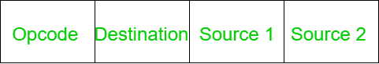

# 3 地址指令和 1 地址指令的区别

> 原文:[https://www . geesforgeks . org/3 地址指令和 1 地址指令的区别/](https://www.geeksforgeeks.org/difference-between-3-address-instruction-and-1-address-instruction/)

先决条件–[指令格式](https://www.geeksforgeeks.org/computer-organization-instruction-formats-zero-one-two-three-address-instruction/)
**1。三地址指令:**
三地址指令是机器指令的一种格式。它有一个操作码和三个地址字段。

**2。单地址指令:**
单地址指令也是一种格式。它只有两个字段。一个用于操作码，另一个用于操作数。

**三地址指令和一地址指令的区别:**

| 三地址指令 | 一地址指令 |
| --- | --- |
| 它有四个字段。 | 它只有两个字段。 |
| 它有一个操作码字段和三个地址字段。 | 它还有一个操作码字段，但只有一个地址字段。 |
| 它的指令长度很长。 | 它的指令较短。 |
| 一条指令可能需要三次存储器访问。 | 一条指令只需要一次内存访问。 |
| 访问处理器内部的位置比访问内存要慢。 | 访问处理器内部的位置比访问内存更快。 |
| 它的缺点是三个存储器访问被两个地址的存储器消除了。 | 它取消了两次内存访问。 |
| 操作数和结果有三个位置。 | 操作数和结果只有一个位置。 |

