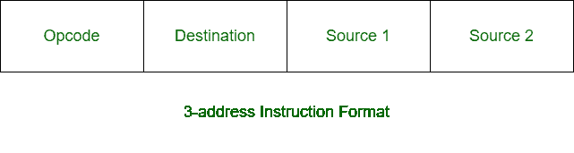
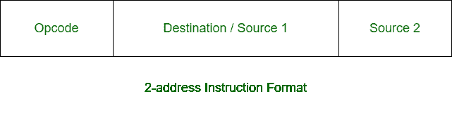

# 3 地址指令和 2 地址指令的区别

> 原文:[https://www . geesforgeks . org/3 地址指令和 2 地址指令的区别/](https://www.geeksforgeeks.org/difference-between-3-address-instruction-and-2-address-instructions/)

先决条件–[指令格式](https://www.geeksforgeeks.org/computer-organization-instruction-formats-zero-one-two-three-address-instruction/)
**1。三地址指令:**
三地址指令是机器指令的一种格式。它有一个操作码和三个地址字段。一个地址字段用于目的地，两个地址字段用于源。



**示例–**

```
X = (A + B) x (C + D) 
```

**解决方案:**

```
ADD R1, A, B      R1 <- M[A] + M[B]
ADD R2, C, D      R2 <- M[C] + M[D]
MUL X, R1, R2     M[X] <- R1 x R2 
```

**2。双地址指令:**
双地址指令是机器指令的一种格式。它有一个操作码和两个地址字段。一个地址字段是通用的，可以用于目的地或源，另一个地址字段用于源。



**示例–**

```
X = (A + B) x (C + D) 
```

**解决方案:**

```
MOV R1, A      R1 <- M[A]
ADD R1, B      R1 <- R1 + M[B]
MOV R2, C      R2 <- M[C]
ADD R2, D      R2 <- R2 + D
MUL R1, R2     R1 <- R1 x R2
MOV X, R1      M[X] <- R1 
```

**三地址指令和二地址指令的区别:**

<center>

| 三地址指令 | 双地址指令 |
| --- | --- |
| 它有四个字段。 | 它有三个字段。 |
| 它有一个操作码字段和三个地址字段。 | 它有一个操作码字段和两个地址字段。 |
| 它的指令长度很长。 | 它的指令较短。 |
| 访问处理器内部的位置比访问内存要慢。 | 访问处理器内部的位置比访问内存更快。 |
| 目标和源有不同的地址字段。 | 目的地和源都有一个地址字段。 |
| 在 3 地址格式中，目标地址不能包含操作数。 | 而在双地址格式中，目标地址可以有操作数。 |
| 在 3 地址格式中，指令较少。 | 而在双地址格式中，指令更多。 |
| 它通常需要三次内存访问。 | 它通常需要两次内存访问，但在某些情况下也需要三次内存访问。 |
| 在 3 地址格式中，需要三次存储器访问。 | 而在 2 地址格式，它消除了三个内存访问，但并不完全。 |

</center>