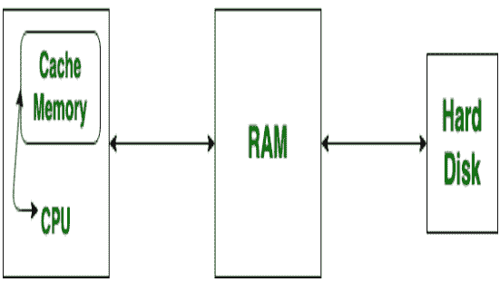
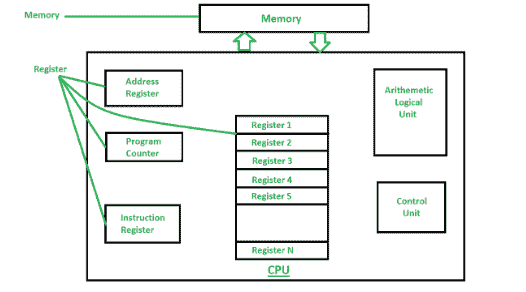

# 缓存和寄存器的区别

> 原文:[https://www . geesforgeks . org/cache-memory-and-register 之差/](https://www.geeksforgeeks.org/difference-between-cache-memory-and-register/)

**1。[高速缓冲存储器](https://www.geeksforgeeks.org/cache-memory-in-computer-organization/) :**
高速缓冲存储器是计算机中一个较小且快速的存储器组件，它被插入到中央处理器和主存储器之间。为了使这种安排有效。高速缓存需要比主存快得多。这种方法比使用快速存储设备来实现整个主存储器更经济。

**2。[寄存器](https://practice.geeksforgeeks.org/problems/what-is-register) :**
寄存器是内置于处理器本身的最小的保存数据元素的寄存器。这些是处理器可以直接访问的内存位置。它保存 32 位到 64 位左右的少量数据，可以保存指令、存储地址或任何类型的数据，如位序列或单个字符。

**例如:**累加器寄存器、程序计数器、指令寄存器、地址寄存器等。

**缓存和寄存器的区别:**

| 没有。 | 高速缓冲存储器 | 注册 |
| 1. | 缓存是计算机中较小且速度最快的内存组件。 | 寄存器是进入处理器的少量快速存储元件。 |
| 2. | 高速缓冲存储器就是一个存储单元。 | 它位于中央处理器上。 |
| 3. | 它在磁盘读写过程中使用。 | 它用于存储和检索信息。 |
| 4. | 它是一个用于临时存储的高速存储区域。 | 它用于临时存储数据以供处理和传输。 |
| 5. | 它将最近使用的数据复制到。 | 它保存着 CPU 当前正在处理的操作数或指令。 |
| 6. | 它减少了平均内存访问时间。 | 它减少了查找存储在内存中的项目所需的时间。 |
| 7. | CPU 访问内存的速度比寄存器快。 | CPU 可以在一个时钟周期内以超过一次操作的速率对寄存器内容进行操作。 |
| 8. | 动态页面缓存、数据库查询缓存都是缓存的例子。 | 循环计数器是寄存器的一个例子。 |

