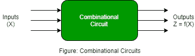
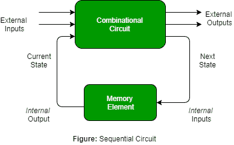

# 组合电路和时序电路特性的差异

> 原文:[https://www . geeksforgeeks . org/组合和时序电路的特性差异/](https://www.geeksforgeeks.org/difference-between-characteristics-of-combinational-and-sequential-circuits/)

先决条件–[组合和时序电路](https://www.geeksforgeeks.org/combinational-and-sequential-circuits/)
**1。组合电路:**
组合电路被定义为不依赖于先前输入产生任何输出的时间无关电路，被称为组合电路。

**2。时序电路:**
时序电路是那些依赖于时钟周期并依赖于现在和过去的输入来产生任何输出的电路。

组合电路和时序电路的主要特点如下-

| 没有。 | 组合电路 | 时序电路 |
| --- | --- | --- |
| (1) | 输出仅取决于当前输入，输入和输出不需要反馈，因此不需要存储元件。 | 输出取决于当前输入和当前状态(先前输出)，因此需要存储元件来保存反馈状态。 |
| (2) | 更容易设计、使用和处理。 | 它并不比组合电路更容易设计、使用和处理。 | (3) | 不需要时钟信号，也不依赖于时间。 | 需要时钟信号，它取决于时间和时钟，因此需要触发。 |
| (4) | 基本构件只是逻辑门。 | 基本构件是触发器。 | (5) | 这些是更快的逻辑电路。 | 这些电路比组合电路慢。 |

