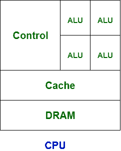
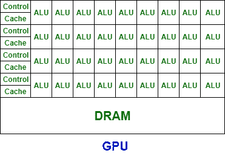

# 中央处理器和图形处理器的区别

> 原文:[https://www . geeksforgeeks . org/CPU 和 gpu 的区别/](https://www.geeksforgeeks.org/difference-between-cpu-and-gpu/)

**中央处理器(CPU):**
CPU 被称为每个根深蒂固的系统的大脑。中央处理器由算术逻辑单元和控制单元组成，算术逻辑单元习惯于快速存储信息和执行计算，控制单元用于执行指令排序和分支。中央处理器与更多的计算机组件交互，如内存、输入和输出，以执行指令。

**图形处理单元(GPU):**
GPU 用于在计算机游戏中提供图像。GPU 的速度比 CPU 快，它强调高吞吐量。它通常与电子设备结合，用于与电子设备共享内存，这对于最重要的计算任务来说很好。它包含的算术逻辑单元比中央处理器多。

CPU 和 GPU 的基本区别是 CPU 强调低延迟。然而，图形处理器强调高吞吐量。

让我们看看 CPU 和 GPU 的区别:

| S.NO | 中央处理器 | 国家政治保卫局。参见 OGPU |
| --- | --- | --- |
| 1. | 中央处理器代表中央处理器。 | 而图形处理器代表图形处理单元。 |
| 2. | CPU 消耗或需要的内存比 GPU 多。 | 而它消耗或需要的内存比 CPU 少。 |
| 3. | CPU 的速度不如 GPU 的速度。 | 而 GPU 比 CPU 的速度快。 |
| 4. | 中央处理器包含微小而强大的内核。 | 而它包含更多的弱核。 |
| 5. | CPU 适合串行指令处理。 | 而 GPU 不适合串行指令处理。 |
| 6. | CPU 不适合并行指令处理。 | 而 GPU 则适合并行指令处理。 |
| 7. | CPU 强调低延迟。 | 而 GPU 则强调高吞吐量。 |