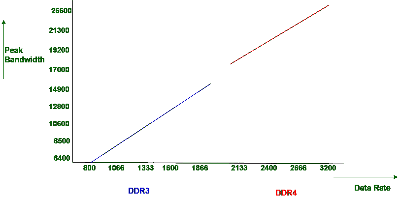

# 【DDR3 和 DDR4 的区别

> 原文:[https://www . geesforgeks . org/difference-DDR 3 和-ddr4/](https://www.geeksforgeeks.org/difference-between-ddr3-and-ddr4/)

DDR3 和 DDR4 都是双倍数据速率(DDR)的版本。

**双倍数据速率版本 3 (DDR3):**
在 DDR3 中，执行自动刷新和自刷新来刷新其内容。一般来说，自刷新用于低功耗，DDR3 比 DDR2 功耗低。DDR3 的时钟速度从 800 MHz 到 2133 MHz 不等，其中 2133 MHz 是其峰值，在某些情况下，一般时钟速度在 1600 到 1800 MHz 之间变化。

**双倍数据速率版本 4 (DDR4):**
在 DDR4 中，仅执行自刷新来刷新其内容，这就是它消耗更少功率的原因。DDR4 的最小时钟速度为 2133 MHz，没有定义最大时钟速度。

让我们看看 DDR3 和 DDR4 的数据速率和带宽图:

在上图中，我们可以看到 DDR3 的时钟速度在 1600 到 1800 MHz 之间变化，其带宽增加，但小于 DDR4。DDR4 的时钟速度从 DDR3 离开的地方开始，但它没有定义最大时钟速度。

让我们看看它们之间的区别，下面以表格形式给出:

| S.NO | DDR3 | DDR4 |
| --- | --- | --- |
| 1. | DDR3 代表双倍数据速率版本 3。 | 而 DDR4 代表双倍数据速率版本 4。 |
| 2. | DDR3 的成本低于 DDR4。 | 虽然它的成本比 DDR3 更高或更多。 |
| 3. | 在 DDR3 中，执行自动刷新和自刷新来刷新其内容。 | 而在 DDR4 中，仅执行自刷新来刷新其内容。 |
| 4. | DDR3 的功耗低于 DDR2，但高于 DDR4。 | 而 DDR4 比 DDR3 功耗低。 |
| 5. | 与 DDR4 相比，DDR3 的速度稍慢。 | 虽然它的速度比 DDR3 快。 |
| 6. | DDR3 最大内存为 16 GB。 | 而 DDR4 没有最大限度或能力。 |
| 7. | DDR3 的时钟速度从 800 兆赫到 2133 兆赫不等。 | 而 DDR4 的最小时钟速度为 2133 MHz，没有定义最大时钟速度。 |
| 8. | DDR3 的延迟低于 DDR4。 | 而 DDR4 的延迟略高于 DDR3。 |
| 9. | DDR3 更早用于计算机系统。 | 而 DDR4 现在每天都在计算机系统中使用。 |