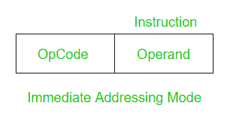

# 直接寻址模式和立即寻址模式的区别

> 原文:[https://www . geesforgeks . org/直接寻址和立即寻址模式的区别/](https://www.geeksforgeeks.org/difference-between-direct-and-immediate-addressing-modes/)

先决条件–[寻址模式](https://www.geeksforgeeks.org/addressing-modes/)

**1。直接寻址模式:**
在直接寻址模式下，地址字段包含操作数的地址。

```
Effective Address (EA) = address field of operand 
```


*示例*:将寄存器 1001 的内容添加到累加器中。

```
Add (1001) 
```

访问数据只需要一个内存引用。所以不需要额外的计算来计算有效地址。

**2。立即寻址模式:**
在立即寻址模式下，操作数是指令的一部分。

```
Here the Operand = Address Field 
```



*例*:累加器加 5。

```
ADD 5 
```

获取数据不需要内存引用。所以不需要额外的计算来计算有效地址。这是一个快速的方法。但缺点是它的范围有限。

现在让我们比较直接寻址和立即寻址模式。

<center>

| 直接寻址模式 | 立即寻址模式 |
| --- | --- |
| 地址字段包含操作数的有效地址 | 没有地址字段，因为操作数是指令的一部分。 |
| 它需要一个内存引用。 | 它不需要任何对内存的引用。 |
| 它比即时模式慢。 | 这是一个更快的过程。 |
| 它比即时模式有更大的范围。 | 它的范围有限。 |
| 示例:添加(1001) | 示例:ADD 5 |

</center>